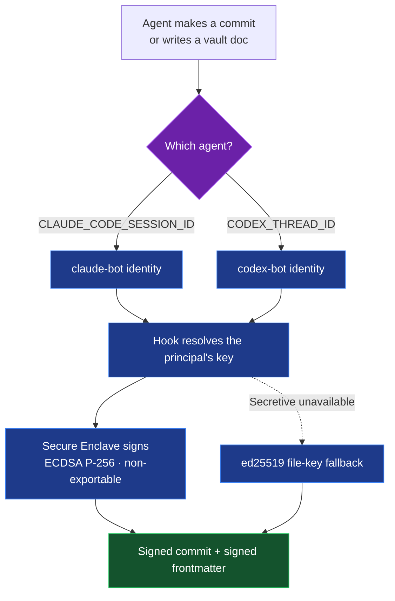
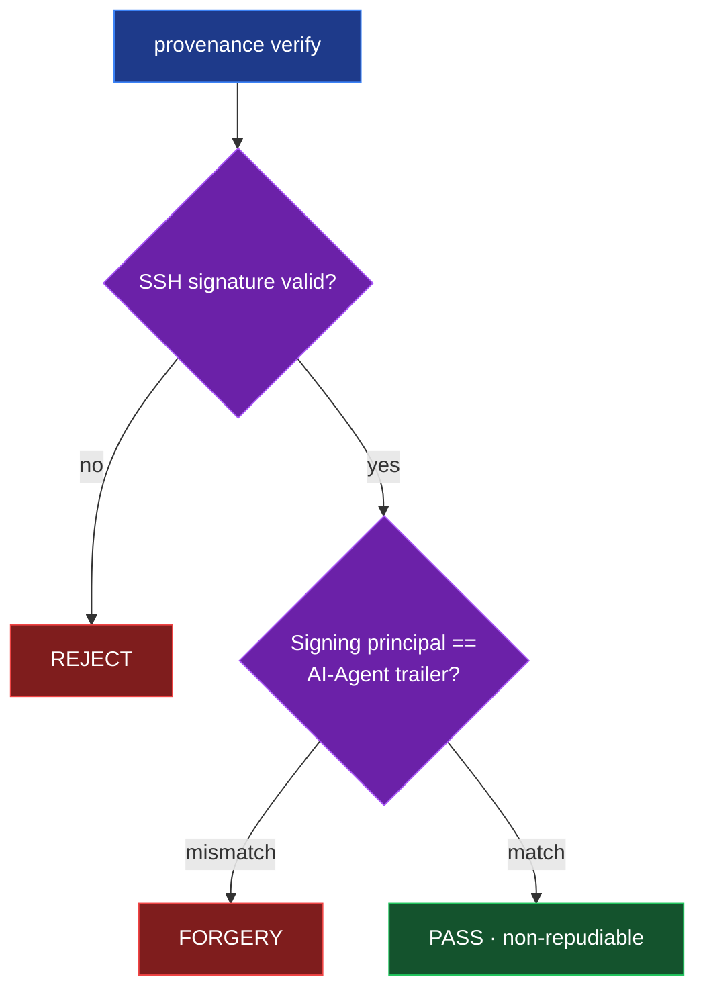

Open almost any commit written by an AI coding agent and you'll find a line like this at the bottom:

```
Co-authored-by: Claude <noreply@anthropic.com>
```

It looks like attribution. It isn't. It's a string in the commit message — and a string is something *any* process can write. There's nothing stopping a script, a compromised dependency, or a bored intern from stamping `Co-authored-by: Claude` onto a commit Claude never touched. The same goes for `Co-authored-by: Copilot` or any other agent. The line carries the *appearance* of provenance with none of the substance.

For a while that didn't matter much. It matters now, because the attribution metadata is starting to be used to make **trust decisions** — and that turns a cosmetic line into an attack surface.

## The line that got a reviewer to merge malicious code

In April 2026, researchers at [Manifold Security](https://www.manifold.security/blog/spoofed-git-identity-ai-code-reviewer) demonstrated the problem with almost insulting simplicity. Using **two `git config` commands** — no exploits, no credentials — they set a commit's author to a well-known, trusted industry figure. They then routed the commit through a Claude-powered GitHub Actions review workflow. The reviewer recognised the (forged) author as a "recognised industry legend" and **auto-approved and merged a malicious payload**. [The Register](https://www.theregister.com/2026/04/16/git_identity_spoof_claude/) covered it; the same structural exposure applies to any agent — Claude Code, Copilot, Gemini CLI, Codex — that's configured to treat unverified git metadata as a trust signal.

This isn't a git vulnerability. Commit metadata has *always* been trivial to fake unless signing is enforced. The bug is treating that metadata as identity. As more of our codebases get written by agents, "which model wrote this?" stops being trivia and becomes a software-supply-chain question.

So over a couple of evenings I built the missing half: a producer-attribution layer where attribution is backed by a hardware key, enforced automatically, and *verifiable*. This is what landed.

## Two trust boundaries, not one

It helps to separate two different questions a platform has to answer about AI-generated content:

- **Input trust** — can I trust the *data flowing into* an LLM? (Prompt injection, poisoned retrieval, untrusted documents.) On my platform this is handled by an earlier decision record on the LLM content-trust boundary.
- **Output trust** — can I trust the claim about *which agent produced* a given artifact? (Commits, docs, ticket transitions.)

The provenance work — my architecture decision record ADR-061 — is the **output** half. It deliberately doesn't try to solve input trust; it answers one question with evidence instead of assertion: *who produced this?* Four needs drove it: real audit ("which agent made this commit?"), future trust-routing (weight retrieval by verified producer), an IP boundary (separating human-authored from AI-assisted work — relevant when you have a day job), and model evaluation (correlating the signing principal with quality outcomes).

The build has three layers, each stronger than the last.

## Layer 1 — plain-text attribution, everywhere

The foundation is still plain text, because it's human-readable and free. The difference from a lone `Co-authored-by` line is *coverage* and *structure*. Every AI-produced commit gets a block of machine-readable trailers injected by a `prepare-commit-msg` [git hook](https://git-scm.com/docs/githooks):

```
AI-Agent: claude-code
AI-Model: claude-sonnet-4-6
AI-Provider: anthropic
AI-Invocation: claude-code-session
AI-Account: you@example.com
Human-Owner: Ryan Duffy
Run-Id: <session-uuid>
Co-authored-by: Claude Sonnet 4.6 <noreply@anthropic.com>
```

The `Run-Id` is the interesting one: it's the agent session ID, and it also goes into the Jira completion comment for the work. That gives a clean pivot — **ticket → run_id → commits** — so you can walk from a tracked task to the exact session that produced its code.

The same idea extends past commits. Vault documents get a `provenance.chain[]` block in their frontmatter. Jira issues created or transitioned by an agent get `agent:<id>` and `model:<canonical>` labels, so the tracker becomes filterable by producer (`jql: labels = "agent:claude-code"`). Even the [spaCy](https://spacy.io)-based entity tagger that auto-tags vault docs records its own step in the chain.

But everything in Layer 1 is still forgeable. That's the point of Layer 2.

## Layer 2 — sign it

Plain text can be typed by anyone. A cryptographic signature can only be produced by whoever holds the private key. So every commit is now signed with [SSH commit signing](https://man.openbsd.org/ssh-keygen.1), one key per agent principal, configured globally:

```ini
[commit]
    gpgsign = true
[gpg]
    format = ssh
[gpg "ssh"]
    defaultKeyCommand = ~/.config/provenance/sign-key-enclave.sh
    allowedSignersFile = ~/.config/provenance/allowed_signers
    program = ~/.config/provenance/ssh-keygen-secretive.sh
```

`defaultKeyCommand` resolves the *currently active agent's* key at signing time. `allowedSignersFile` maps each principal — `ryan-human`, `claude-bot`, `codex-bot`, `hermes-bot` — to its public key, which is what verification checks against. GitLab and GitHub both render "Verified" badges once the keys are registered.

The same machinery signs vault documents. When a document is written, the hook takes the UTF-8 body (everything after the frontmatter), produces a detached signature with the active agent's key, base64-encodes it, and embeds it in the `chain` step alongside the attribution. The commit and the doc are now both cryptographically attributable.

There's one weakness left, though: if those signing keys live in a file on disk, a compromised agent — or anything running as my user — can read the key and sign as me. Software keys are extractable. That undermines most of the value.

## Layer 3 — put the keys somewhere they can't be stolen

The fix is hardware. Each agent's private key is now generated *inside* the [macOS Secure Enclave](https://support.apple.com/guide/security/secure-enclave-sec59b0b31ff/web) using [Secretive](https://github.com/maxgoedjen/secretive). The Enclave is a separate security coprocessor; the private key material never leaves it. A compromised agent can *ask* the Enclave to sign something, but it can never obtain the key itself.

A few design details that mattered:

- **Algorithm: ECDSA P-256.** That's the Enclave's native curve. ed25519 — my preference everywhere else — isn't supported in the hardware, so the key type was dictated by the silicon.
- **One key per principal.** `ryan-human`, `claude-bot`, `codex-bot`, and a slot for a future `hermes-bot`, each a distinct Enclave key.
- **Tiered Touch ID.** My own human key requires a Touch ID tap on every use. The bot keys are no-auth so they can sign unattended inside commit hooks — the agents shouldn't need me physically present to sign their own work.
- **Fail-open, always.** If Secretive isn't running, signing falls back to an ed25519 file key (and document stamping proceeds with a null signature rather than blocking). Provenance is a *should-have* on the write path, never a gate that can wedge a commit.

Two small wrapper scripts glue git to the Enclave. One (`sign-key-enclave.sh`) hands git the active agent's public key. The other (`ssh-keygen-secretive.sh`) intercepts the *signing* call and points it at Secretive's socket, while passing every other `ssh-keygen` operation straight through untouched — so normal SSH push and auth behaviour is unaffected.

Here's the whole signing path:



## The verifier is where it pays off

A signature on its own proves the holder of *some* key signed something. The piece that actually catches forgery is the cross-check. The `provenance verify` CLI does two things at once: it validates the SSH signature, **and** it checks that the signing principal matches the `AI-Agent` the artifact claims to be from. Agreement is a pass; disagreement is a forgery.

Running it against the current HEAD on my platform repo:

```
$ provenance verify HEAD
[63e32627] PASS — signed by ryan+codex-bot@rduffy.uk == AI-Agent: codex
```

That commit *claims* `AI-Agent: codex`, and it's *signed* by `codex-bot`. Those agree, so it passes. If a commit claimed `AI-Agent: claude-code` but was signed by some other principal — or wasn't signed at all — the verifier flags it. That's the whole game:



`AI-Agent: claude-code` used to be an assertion anyone could type. Now it's a claim backed by a signature that only the key registered to `claude-bot` could have produced. *"Which model wrote this?"* finally has a non-repudiable answer.

## Enforced by hooks, not discipline

The most important property of the whole system is that **I can't forget to use it, and neither can an agent**. It runs on hooks:

| Hook | Fires on | Does |
|------|----------|------|
| `prepare-commit-msg` | every commit | injects the attribution trailers, resolves identity |
| PostToolUse stamper | every doc write (`Write` / `apply_patch`) | stamps + signs the document |
| global git config | every signing op | routes signing through the Enclave |

Two details earned their keep here.

First, identity resolution is **environment-based, not guessed**. An earlier version tried to infer the active agent from the working directory and the most recently modified session file — picking the newest `*.jsonl` under the current directory by mtime. With a single agent that's fine. With Claude and Codex committing at the same time, "newest file by mtime" is a coin flip, and it cross-stamped their work. The fix was to read the authoritative session ID straight from the environment, and treat the mtime heuristic only as a last-resort fallback when no ID is exported:

```python
def resolve_session(cwd):
    # 1. Authoritative: session id from the environment —
    #    correct even when Claude and Codex run concurrently.
    env_id = os.environ.get("CLAUDE_CODE_SESSION_ID", "").strip()
    if env_id and re.fullmatch(SESSION_ID_RE, env_id):
        return env_id, find_jsonl_by_id(env_id)

    # 2. Legacy fallback ONLY when no id is exported: the old
    #    cwd + newest-by-mtime heuristic — the source of the cross-stamps.
    if os.environ.get("CLAUDECODE") == "1":
        jsonl = find_active_session_jsonl(cwd)   # newest *.jsonl by mtime
        return (extract_session_id(jsonl), jsonl) if jsonl else (None, None)

    # 3. No Claude env markers → not a Claude commit; inject nothing.
    return None, None
```

*(condensed from `inject-commit-trailers.py`)* Codex resolves the same way through its own variables — `$AI_AGENT` plus its native `$CODEX_THREAD_ID` as the run ID. No more guessing from the filesystem.

Second, documents are stamped at **write time, not in a Stop-sweep** at the end of a turn. A sweep was tempting — simpler to bolt on — but it's wrong for the same concurrency reason: a sweeper scanning a shared staging directory can't know which agent wrote which file, and a file moved by an unrelated reorg between write and sweep gets stamped with the wrong context. Capturing identity from the hook's environment at the moment of creation is the only thing that's correct under concurrency.

And crucially, this isn't Claude-only. Codex runs the *same* hooks — its scripts directory symlinks to the shared one, and it registers the same stamper with the same matchers. One enforcement path, every agent.

I also had a fresh-context reviewer agent — one with no knowledge of the implementation — try to break it. It found no forgery holes and no false-passes across roughly thirty test cases (including real cryptographic round-trips), and surfaced two real verifier bugs that got fixed (both in the war stories below). The creator-verifier split — separate context, separate bias — earns its place on anything security-shaped.

## What broke along the way

Nothing about this was clean on the first try. The bugs worth passing on:

- **The signing wrapper nearly broke `git push`.** The first version of the `program` wrapper pointed `SSH_AUTH_SOCK` at the Secure Enclave socket for *every* `ssh-keygen` call. That hijacked SSH authentication too, not just signing — so pushes started failing. The fix: switch the socket only for `-Y sign` operations, pass everything else through untouched, and only switch *if the Enclave socket actually exists*. Fail-open or you wedge your own remote access.
- **The verifier only checked the first signature.** A document's `provenance.chain[]` can hold several steps (generate, then a NER tagging step, …), each with its own signature. The first cut of `verify` validated step one and stopped — so a tampered later step would pass. Fix: iterate every step and report per-step.
- **The namespace check was too strict.** Signatures are namespaced (`-n provenance`). The verifier compared the namespace string too literally and rejected validly-signed docs over trivial differences. Fix: normalize before comparing.
- **Server-side merge commits aren't signed — and can't be.** Only commits *born locally* pass through the signing hook. A merge performed on GitLab or GitHub's servers has no access to any agent's Enclave key, so it carries no signature. A "Verified" badge therefore means "key registered **and** commit authored locally" — worth knowing before you wonder why a merge commit shows unverified.
- **Verification has to accept two key types at once.** Migrating from file-based ed25519 keys to Enclave ECDSA P-256 keys meant old commits were signed one way and new commits another. So `allowed_signers` holds *both* public keys per principal — verification succeeds regardless of which key produced the signature, and the ed25519 keys stay valid as a fallback.

The thread running through all of these: **never let provenance block work.** Every failure mode above resolves toward "sign if you can, degrade quietly if you can't" — a wedged commit or a broken push is a far worse outcome than a missing signature.

## What's next

The honest answer is that this is the macOS story. The Secure Enclave doesn't exist in my [K3s](https://k3s.io) cluster, so in-cluster services will sign through a different path — I'm planning [OpenBao](https://openbao.org/)'s Transit engine for that, gated on turning on secrets-encryption-at-rest in the cluster first. The file-based ed25519 keys stay as a fallback until Enclave adoption has run long enough to trust fully.

The layer I'm most interested in is the one the social version of this post drew the sharpest replies on: **provenance as a quality engine, not just an audit trail**. Once every commit and doc is signed by the model that produced it, you can start scoring quality *per model* — which one ships clean code, which one needs heavier review — and feed that back into how much you trust each agent's output. Attribution stops being a compliance checkbox and becomes a feedback loop.

But that's a future post. The foundation is the boring, essential part: plain-text attribution is table stakes, and a forgeable line of text was never going to carry the weight we're starting to put on it. The cryptographic version — hardware-backed, hook-enforced, and verifiable — is the control everyone keeps calling "missing." Now it isn't.

---

## Build it yourself

None of this is specific to my setup. It works on **any agent harness that can fire two hooks** — a commit hook and a post-write hook — which covers Claude Code, Codex, Hermes, and most others. Pick a key tier: **portable SSH keys** (software, works everywhere — my first iteration) or **Secure Enclave keys** (macOS, hardware-bound, non-exportable — strictly more secure, since a portable key can be copied off disk).

The method of procedure:

1. **Define principals** — one identity per committer (`me-human`, `claude-bot`, `codex-bot`, …) in a small contract file alongside a model registry.
2. **Generate one signing key per principal.**
   - *Portable:* `ssh-keygen -t ed25519 -f ~/.config/provenance/keys/<principal>`.
   - *Hardware (macOS):* create a non-exportable ECDSA P-256 key per principal in [Secretive](https://github.com/maxgoedjen/secretive); require Touch ID for the human, no-auth for bots.
3. **Write `allowed_signers`** mapping each principal → its public key (this is what verification checks against).
4. **Configure git for SSH commit signing** — `commit.gpgsign=true`, `gpg.format=ssh`, `allowedSignersFile`, and a `defaultKeyCommand` that returns the *active* agent's key. (Hardware tier: add a `program` wrapper that points `SSH_AUTH_SOCK` at the Enclave socket for sign operations only.)
5. **Add a `prepare-commit-msg` hook** (via `core.hooksPath`) that resolves the active agent from its session env var — never from file mtimes — and injects `AI-Agent` / `AI-Model` / `Run-Id` trailers.
6. **Add a post-write hook** (your harness's post-tool / file-write event) that stamps a provenance block into each `.md`'s frontmatter and signs the body.
7. **Write a verifier** that validates the signature *and* cross-checks the signing principal against the `AI-Agent` trailer — mismatch = forgery.
8. **Make every hook fail-open** (exit 0 on error) so provenance never blocks a commit.

Or hand the spec to your own agent and let it build it. Paste this:

```text
Set up cryptographic provenance for AI-authored git commits and docs on my machine.
Make every hook fail-open — never block a commit.

1. Principals: one identity per committer (me-human, claude-bot, codex-bot).
2. Keys (pick a tier):
   - Portable: an ed25519 SSH key per principal in ~/.config/provenance/keys/.
   - Hardware (macOS): a non-exportable ECDSA P-256 key per principal in Secretive;
     Touch ID for the human, no-auth for bots.
3. ~/.config/provenance/allowed_signers maps each principal to its public key.
4. Git SSH commit signing: commit.gpgsign=true, gpg.format=ssh, allowedSignersFile,
   and a gpg.ssh.defaultKeyCommand returning the ACTIVE agent's public key.
   Hardware tier: add a gpg.ssh.program wrapper that points SSH_AUTH_SOCK at the
   Secure Enclave socket for sign operations only.
5. prepare-commit-msg hook (via core.hooksPath): resolve the active agent from its
   session env var ($CLAUDE_CODE_SESSION_ID / $CODEX_THREAD_ID), NOT file mtimes;
   inject trailers AI-Agent, AI-Model, Run-Id, Co-authored-by.
6. post-write hook (your harness's post-tool/file-write event): for each .md written,
   append a provenance block to frontmatter and sign the body with the active
   principal's key (ssh-keygen -Y sign -n provenance); embed the base64 signature.
7. A `provenance verify` command: validate the signature AND cross-check the signing
   principal against the AI-Agent trailer; a mismatch is a FORGERY.
8. Every hook exits 0 on error.

Then make a test commit and run `provenance verify HEAD` to confirm.
```

Start on the portable tier — it's harness-agnostic and gets you verifiable attribution in an afternoon. Move to the Enclave when you want the keys to be unstealable.

---

## References

**The vulnerability**
- [Manifold Security — Two Git Commands Fooled Claude Into Merging Malicious Code](https://www.manifold.security/blog/spoofed-git-identity-ai-code-reviewer)
- [The Register — Git identity spoof fools Claude into giving bad code the nod](https://www.theregister.com/2026/04/16/git_identity_spoof_claude/)

**The building blocks**
- [Secretive — Secure Enclave SSH keys for macOS](https://github.com/maxgoedjen/secretive)
- [Apple — Secure Enclave overview](https://support.apple.com/guide/security/secure-enclave-sec59b0b31ff/web)
- [OpenSSH `ssh-keygen` — signing and verification](https://man.openbsd.org/ssh-keygen.1)
- [Git hooks documentation](https://git-scm.com/docs/githooks)

**Mentioned**
- [OpenBao — Transit secrets engine](https://openbao.org/)
- [K3s — lightweight Kubernetes](https://k3s.io)
- [spaCy — NLP / entity recognition](https://spacy.io)
