# Episode 4: Three Systems, One Weekend - The Parallel Testing Chronicle

**Series**: Season 2 - Building in Public
**Episode**: 4 of ?
**Dates**: October 11-13, 2025 (48 hours of active work)
**Reading Time**: 16 minutes

```
    ⏱️  THE 48-HOUR DEPLOYMENT
    ┌────────────────────────────────────────────┐
    │  Oct 11 (Day 1): Crisis & Foundation       │
    │  09:00-20:00 → Neural Vault Emergency      │
    │                                            │
    │  • ChromaDB crisis (38K docs locked)       │
    │  • 3 critical bugs fixed                   │
    │  • Fresh reindex (41,730 docs)             │
    │  • NER system 163x faster                  │
    │                                            │
    │  ─────────────────────────────────────────│
    │  Oct 12 (Day 2): The Triple Deploy         │
    │  06:00-23:47 → 73 files modified           │
    │                                            │
    │  • Journal v3 (8-task Prefect pipeline)    │
    │  • Hybrid Search (A/B tested + deployed)   │
    │  • 7 Slash Commands (production-ready)     │
    │  • Feature flag infrastructure             │
    │                                            │
    │  ─────────────────────────────────────────│
    │  Oct 13 (Day 3): Validation & Reflection   │
    │  00:00-08:00 → Parallel testing begins     │
    │                                            │
    │  • v2 vs v3 comparison framework           │
    │  • Monitoring dashboards configured        │
    │  • 7-day testing period starts             │
    │                                            │
    │  Total: 3 major systems, 0 downtime        │
    └────────────────────────────────────────────┘
```

**Compression Note**: This episode references 20 of 109 files modified across October 11-13, 2025 (18% coverage). Excluded files: 47 automated journal tests, 28 technical configuration tweaks, 14 duplicate conversation exports. Compression ratio: 5.45:1. The story focuses on the three major system deployments rather than the dozens of small fixes and adjustments that happened alongside them.

---

## 🚨 Day 1: When Your Database Refuses to Open

*Vault Evidence: 2025-10-11-Neural-Vault-Codebase-Review-2025-Best-Practices.md*

**October 11, 2025 at 09:05 AM**

I asked Claude to do an ULTRATHINK review of the neural-vault codebase. "Find any issues. Search the web for 2025 best practices. No holds barred."

Working together with Claude throughout the morning, after reviewing the codebase for 2025 best practices, we decided to do a fresh reindex to ensure all metadata enhancements were properly applied. The existing ChromaDB collection had 38,348 documents.

### The Vector Database Version Crisis

Here's what happened:

**The Good**:
- ChromaDB upgraded from 0.4.x → 1.1.1 (massive improvements)
- HNSW index algorithm much faster
- Better memory management
- Production-grade stability

**The Bad**:
- Old database format incompatible with new version
- Can't downgrade (would lose bug fixes)
- Can't upgrade database in-place (no migration tool)
- 38,348 documents effectively locked

**The Solution**:
Fresh reindex from scratch. 774 markdown files in the vault. Every file needs:
- Temporal metadata extraction (date, time, year, month, quarter)
- Semantic chunking (split into meaningful sections)
- Vector embedding generation (mxbai-embed-large model)
- Metadata persistence (22 fields per chunk)

**Estimated time**: 2-3 hours

**Actual time**: 40 minutes (batch processing + entity caching)

### Three Critical Bugs Fixed

While investigating, I found 3 more issues:

**Bug #1: Metadata Persistence Failure**

Context paths and semantic chunk flags weren't being stored in ChromaDB. The indexer was generating them, then throwing them away before storage.

**Fix**: Add 109 lines to `vault_indexer.py` to merge temporal + chunker metadata.

**Impact**:
- Before: Can't track which document a chunk came from
- After: Full provenance tracking for every result

**Bug #2: NER Entity Caching Missing**

The Named Entity Recognition system was calling Ollama for every file, every time. No caching. If you ran it twice, it would:
1. First run: 30 seconds per file
2. Second run: 30 seconds per file (same work repeated)

**Fix**: Add entity caching with JSON persistence.

**Impact**: 163x speedup for re-runs (30 seconds → 0.18 seconds)

**Bug #3: No Retry Logic**

Ollama sometimes times out. The NER pipeline would just fail. No retries, no exponential backoff, no graceful degradation.

**Fix**: Add retry logic with exponential backoff [10s, 30s, 60s].

**Impact**: Error rate drops from 4.5% → <0.5%

### The 41,730 Document Reindex

After fixing all three bugs, I did a fresh reindex:

```bash
$ python vault_indexer.py --full-reindex --verbose

Processing 774 markdown files...
Extracting temporal metadata...
Running semantic chunking...
Generating embeddings...
Storing in ChromaDB...

✅ Complete: 41,730 document chunks indexed
   Memory usage: 2.3GB
   Index time: 38 minutes
   Search speed: <20ms per query
```

**Key metrics**:
- **Before**: 38,348 documents (locked, unusable)
- **After**: 41,730 documents (accessible, fast)
- **Difference**: +3,382 documents (new vault content since last index)

```mermaid
flowchart TB
    Start([774 Markdown Files]) --> Check{ChromaDB<br/>Version Check}
    Check -->|v0.4.x DB| Error[❌ 38,348 docs locked<br/>Format incompatible]
    Check -->|Fresh Start| Extract[Extract Temporal Metadata<br/>date, time, year, month, quarter]

    Error --> Decision{Options?}
    Decision -->|Downgrade| Risk[❌ Lose bug fixes]
    Decision -->|Migrate| NoTool[❌ No migration tool]
    Decision -->|Fresh Reindex| Extract

    Extract --> Chunk[Semantic Chunking<br/>Split into meaningful sections]
    Chunk --> Embed[Generate Embeddings<br/>mxbai-embed-large model]
    Embed --> Store[Store in ChromaDB v1.1.1<br/>22 metadata fields per chunk]
    Store --> Cache[Entity Caching<br/>163x speedup on re-runs]
    Cache --> Retry[Retry Logic<br/>Exponential backoff]
    Retry --> Complete([✅ 41,730 docs indexed<br/>38 min, <20ms search])

    style Error fill:#ef4444,stroke:#dc2626,color:#fff
    style Complete fill:#10b981,stroke:#059669,color:#fff
    style Extract fill:#3b82f6,stroke:#2563eb,color:#fff
    style Chunk fill:#3b82f6,stroke:#2563eb,color:#fff
    style Embed fill:#3b82f6,stroke:#2563eb,color:#fff
    style Store fill:#3b82f6,stroke:#2563eb,color:#fff
```



---

## 🚀 Day 2: The Triple Deploy (73 Files in One Day)

*Vault Evidence: 2025-10-12-reflection-journal.md*

**October 12, 2025 - The Big Day**

With Neural Vault fixed and stable, working with Claude we had a decision to make:

**Option A**: Ship one system at a time (conservative, slow)
**Option B**: Ship all three systems in parallel testing mode (aggressive, fast)

We chose Option B. Here's why.

### System 1: Journal v3 - The 8-Task Pipeline

**Background**: The v2 journal automation had 3 tasks:
1. Scanner (find conversations + file changes)
2. Analyzer (call Ollama for insights)
3. Updater (write to journal file)

**Simple. Effective. But limited.**

Journal v3 is a complete redesign with 8 integrated tasks:


**Key improvements over v2**:
- **Session detection**: Automatic work session boundaries
- **Temporal context**: Compare today against 30-day baselines
- **Causal chains**: "X happened because Y, which led to Z"
- **Hallucination detection**: <1.5% error rate (ensemble verification)
- **Workflow analysis**: AI suggests bottlenecks + improvements

**Deployment strategy**: Parallel testing (v2 + v3 run side-by-side for 7 days)

**Cron schedule**:
```bash
# v2 (Production) - 22:00 daily
0 22 * * * prefect deployment run 'journal-automation/journal-automation'

# v3 (Testing) - 22:05 daily (5 min offset to avoid conflicts)
5 22 * * * prefect deployment run 'journal-automation-v3/journal-automation-v3'
```

**Output locations**:
- v2: `01-Journal/YYYY-MM-DD.md` (production)
- v3: `01-Inbox/YYYY-MM-DD-v3-Journal-Test.md` (testing)

**Switchover criteria**: If v3 wins quality comparison 5+ of 7 days → promote to production.

**Build context**: Journal v3 components were built over 4 weeks prior to October 12 (Week 1: ensemble detection, Week 2: MCT + sessions, Week 3: temporal + causal, Week 4: agentic AI + auto-docs). October 12 was integration day - unifying 5,400+ lines of research-backed code into the 8-task Prefect pipeline.

*Source: 2025-10-12-192639-Journal-v3-BUILD-PHASE-COMPLETE.md*

### System 2: Hybrid Search - The A/B Test

**Context**: ChromaDB uses vector embeddings for semantic search. Fast. Accurate. But sometimes misses exact keyword matches.

**The Theory**: Add BM25 keyword search + use Reciprocal Rank Fusion to combine results.

**Expected result**: 30-40% better recall (based on 2025 research papers).

**Actual result**:

```
┌─────────────────────────────────────────────────┐
│         A/B Testing Results (20 queries)        │
├─────────────────────────────────────────────────┤
│                                                 │
│  Baseline (Vector-Only):                        │
│    Relevance: 96.7%                             │
│    Speed:     19ms avg                          │
│                                                 │
│  Hybrid (BM25 + Vector):                        │
│    Relevance: 98.3%                             │
│    Speed:     520ms avg                         │
│                                                 │
│  Improvement: +1.7% relevance                   │
│  Cost:        27x slowdown                      │
│                                                 │
│  Conclusion: ❌ NOT WORTH IT                     │
│                                                 │
└─────────────────────────────────────────────────┘
```

**Wait, so why deploy it?**

Because A/B testing only measures average case. There might be specific query types where hybrid search wins big. Working with Claude, we decided to:

1. **Implement it fully** (3 hours work)
2. **Deploy behind feature flag** (`core.hybrid_search`, default: OFF)
3. **Let users opt-in** for testing
4. **Collect real-world data** for 30 days
5. **Re-evaluate** with production query patterns

**Feature flag pattern**:
```python
from core.feature_flags import flags

if flags.is_enabled("core.hybrid_search", fallback=False):
    results = hybrid_search(query, n_results)  # 520ms
else:
    results = vector_search(query, n_results)  # 19ms (default)
```

**Benefit**: Zero production impact. Can enable per-user. Instant rollback if issues.

### System 3: Slash Commands - The Developer Experience Upgrade

**Context**: Claude Code supports custom slash commands (like `/blog`, `/search`). They're powerful but were missing key features.

**Implemented 7 improvements** in 1.5 hours:

**1. `/blog` - Link Validation** (20 min)
- Validates internal markdown links before publishing
- Catches broken links (saves 5-10 min debugging per broken link)
- Adds to Gate 2 (Content Quality) checks

**2. `/blog` - Build Caching** (15 min)
- Checks `git diff` to see if blog files changed
- Skips `npm run build` if no changes (saves 12 seconds per publish)
- Still runs build if changes detected or git unavailable

**3. `/system` - Quick Health Check** (20 min)
- Shows GPU status, ChromaDB health, Ollama models, Prefect deployments
- One command instead of 5 separate checks
- Updates every time (no caching)

**4. `/search` - Semantic Vault Search** (10 min)
- Direct access to `auto_search_vault` MCP tool
- Supports temporal filters (`--date`, `--start-date`, `--end-date`)
- Returns rich results with context paths

**5. `/flags` - Feature Flag Dashboard** (15 min)
- Shows all 15 feature flags (8 core + 7 journal v3)
- Current status (enabled/disabled)
- Allows toggling without editing Python files

**6. `/deploy` - Prefect Deployment Manager** (15 min)
- List deployments
- Run flows manually
- Check flow run status
- Inspect deployment details

**7. `/idea` - Semantic Idea-Tree Search** (10 min)
- Originally was flat file append
- Now uses ChromaDB semantic search to find related ideas
- Prevents duplicate idea entries

**Total time**: ~1.5 hours (faster than estimated 3-4 hours)

**Impact**: Daily workflow feels 10x smoother.

---

## 🏗️ The Foundation Work: Core Module Refactoring (Morning → Afternoon)

*Vault Evidence: 2025-10-12-Core-Module-Refactored-Design-Implementation-Plan.md, 2025-10-12-151217-Core-Module-Extraction-Analysis-Report.md, 2025-10-12-174033-Core-Module-Phases-1-2-3-COMPLETE.md, 2025-10-12-Scripts-Migration-Outside-Vault.md*

**The Real Story of October 12**

Before Journal v3, Hybrid Search, or Slash Commands were deployed, working with Claude we did the critical foundation work: **a complete architectural redesign of the codebase**. This wasn't work happening "alongside" the deployments - this WAS the work of October 12. The refactoring came first (morning through afternoon), and THEN the features were integrated in the evening using that new foundation.

### The Code Review Decision

Before building Journal v3, I asked Claude to do a full code review of the automation scripts. The diagnosis came back in 2 hours:

**"You have 3,500 lines of duplicated code across 131 Python scripts."**

*Source: Core Module Extraction Analysis Report (2025-10-12 15:12) - analyzed 12,434 total lines across 30+ scripts, identified 28% duplication in common patterns.*

Every script was reinventing the same patterns:
- Vault path discovery (18 different hardcoded paths)
- ChromaDB client initialization (repeated in 23 scripts)
- Ollama LLM client setup (copied across 45 files)
- Prefect configuration (duplicated in every workflow)
- Error handling patterns (inconsistent implementations)

**The problem**: Any change to ChromaDB configuration required editing 23 files. Any vault path update meant touching 18+ scripts. This wasn't sustainable.

### The ULTRATHINK Discovery

Working with Claude, we ran an ULTRATHINK analysis to map every path dependency in the codebase. The initial estimate: 16 paths needed.

**The reality**: **18 paths** (discovered after deep analysis).

**What we missed**:
```python
# Initial design (incomplete):
journal_dir = vault_path / "01-Journal"
inbox_dir = vault_path / "01-Inbox"
blog_source_dir = vault_path / "10-Blog" / "published"

# After ULTRATHINK (complete):
system_dir = vault_path / "09-System"          # ← Missing parent!
scripts_dir = system_dir / "Scripts"            # ← 6 scripts needed this
blog_dir = vault_path / "10-Blog"              # ← Missing parent!
blog_source_dir = blog_dir / "published"       # ← 11 scripts needed this
```

**Key insight**: We weren't just missing subdirectories - we were missing **parent directories** that other scripts depended on. ULTRATHINK caught what manual analysis missed.

### The Core Module Architecture

**The solution**: Extract all duplicated code into a centralized core module with 5 submodules:


**Impact**:
- **Before**: 3,500 lines duplicated across 131 scripts
- **After**: ~1,300 lines in core module (used by all scripts)
- **Reduction**: 63% less code to maintain

**Pattern example (ChromaDB client)**:
```python
# Old way (duplicated in 23 scripts):
import chromadb
client = chromadb.PersistentClient(path="./chromadb_data")
collection = client.get_collection("obsidian_vault_mxbai")

# New way (singleton in core module):
from core.chromadb import get_chromadb_client
client = get_chromadb_client()  # Auto-configured, cached
```

**Benefit**: Update ChromaDB config once in `core/chromadb/`, all 23 scripts inherit the change.

### The Scripts Migration Decision

While designing the core module, we discovered a deeper architectural issue: **The vault was mixing content with code**.

**The problem**:
```
obsidian-vault/
├── 01-Journal/          # Content (for reading)
├── 02-Active-Work/      # Content (for reading)
├── 09-System/
│   └── Scripts/         # Code (for execution) ← Wrong location!
└── 10-Blog/             # Content (for reading)
```

**Scripts stored in the vault meant**:
- Obsidian indexed Python files (polluted search results)
- Vault backups included automation code
- Git history mixed content changes with code changes
- Hard to separate "what I wrote" from "how it runs"

**The solution**: Clean architectural separation:

```mermaid
graph LR
    subgraph Before["❌ BEFORE: Mixed Architecture"]
        direction TB
        V1[obsidian-vault/]
        V1 --> Content1[01-Journal/<br/>02-Active-Work/<br/>10-Blog/]
        V1 --> Code1[09-System/Scripts/<br/>⚠️ Automation code<br/>pollutes search]

        style V1 fill:#ef4444,stroke:#dc2626,color:#fff
        style Code1 fill:#f59e0b,stroke:#d97706,color:#fff
    end

    subgraph After["✅ AFTER: Clean Separation"]
        direction TB
        V2[obsidian-vault/<br/>Content ONLY]
        Scripts[scripts/<br/>38 automation files]
        Core[core/<br/>4 modules, 1,300 lines]
        Neural[neural-vault/<br/>ChromaDB backend]

        V2 --> Content2[01-Journal/<br/>02-Active-Work/<br/>10-Blog/]
        Scripts --> Journal[journal/ - 11 scripts<br/>blog/ - 9 scripts<br/>vault/ - 4 scripts]

        style V2 fill:#10b981,stroke:#059669,color:#fff
        style Scripts fill:#3b82f6,stroke:#2563eb,color:#fff
        style Core fill:#10b981,stroke:#059669,color:#fff
        style Neural fill:#f59e0b,stroke:#d97706,color:#fff
    end

    Before -.->|Refactoring<br/>Oct 12, 17:28| After
```



**Key principle**: "Vault is the output/consumption front-end, not for implementation code."

### Why Journal v3 Required This Foundation

This refactoring work was completed BEFORE Journal v3 integration - **the core module had to exist first so v3 could be built on solid ground**.

Journal v3's 8-task pipeline required:
- Reliable vault path discovery (18 paths, not 16)
- Consistent ChromaDB access (singleton client)
- Proper LLM client pooling (avoid connection leaks)
- Centralized Prefect configuration
- Feature flag infrastructure (Unleash)

**If we had tried to integrate Journal v3 without the core module first**:
- Hardcoded paths (would break when vault moves)
- Duplicate ChromaDB connections (memory leaks from 8 tasks)
- Inconsistent error handling (silent failures in pipeline)
- No feature flag control (couldn't toggle v3 modules independently)

**The timeline** (Oct 12):


**Timeline breakdown**:
- **15:12**: Core Module Extraction Analysis Report (30+ scripts analyzed, 3,500 lines duplication found)
- **16:07**: Core Module Refactored Design Plan created (18 paths discovered via ULTRATHINK)
- **16:53**: Unleash feature flags deployed (feature_flags.py, infrastructure ready)
- **17:21**: Scripts migration plan documented
- **17:28**: Scripts migration COMPLETE (38 scripts moved from vault)
- **17:40**: Core Module Phases 1-3 COMPLETE (config, clients, decorators - 1,300 production lines)
- **19:26**: Journal v3 BUILD PHASE COMPLETE (integrated with new core module)

*Source: File timestamps, 2025-10-12-174033-Core-Module-Phases-1-2-3-COMPLETE.md, 2025-10-12-192639-Journal-v3-BUILD-PHASE-COMPLETE.md*

**Result**: By 17:40, the core module was complete. At 19:26, Journal v3 was integrated on that solid foundation with singleton clients, centralized paths, and feature flag infrastructure for the 8-task pipeline. The refactoring came FIRST, then the integration.

### Why This Matters

**Surface metrics** (Oct 12):
- 73 files modified
- 1,520 lines of new production code
- 3 major systems deployed

**Hidden work** (Oct 12):
- 3,500 lines of duplication eliminated
- 18-path configuration system discovered
- Scripts migrated out of vault
- Core module architecture established

**The lesson**: The deployments you see (Journal v3, Hybrid Search, Slash Commands) were only possible because of the foundation work you don't see (code review, refactoring, architecture redesign).

**Next impact**: Every future automation script benefits from core module. No more reinventing path discovery, ChromaDB access, or LLM client setup. Write 200 lines instead of 450 lines.

---

## 🧪 The Parallel Testing Framework

Here's the key insight: **You can't manually test everything when you're shipping infrastructure changes**.

So instead of trying to predict every edge case, I built a parallel testing framework:

```mermaid
graph TB
    subgraph Production["Production (v2) - Zero Risk"]
        V2Cron[Cron: 22:00 daily]
        V2Flow[journal-automation<br/>3 tasks, proven stable]
        V2Output[01-Journal/<br/>YYYY-MM-DD.md]

        V2Cron --> V2Flow --> V2Output

        style V2Flow fill:#10b981,stroke:#059669,color:#fff
        style V2Output fill:#e8f5e9,stroke:#4caf50,color:#fff
    end

    subgraph Testing["Testing (v3) - Shadow Mode"]
        V3Cron[Cron: 22:05 daily<br/>5 min offset]
        V3Flow[journal-automation-v3<br/>8 tasks, new features]
        V3Output[01-Inbox/<br/>YYYY-MM-DD-v3.md]

        V3Cron --> V3Flow --> V3Output

        style V3Flow fill:#8b5cf6,stroke:#6d28d9,color:#fff
        style V3Output fill:#fef3c7,stroke:#f59e0b,color:#fff
    end

    Compare{Daily Comparison<br/>7 days}
    V2Output --> Compare
    V3Output --> Compare

    Compare -->|Quality| Score1[Completeness<br/>Accuracy<br/>Insights]
    Compare -->|Performance| Score2[Runtime<br/>Error rate<br/>Resource usage]
    Compare -->|User Value| Score3[Actionability<br/>Readability<br/>Overall preference]

    Score1 --> Decision{Confidence ≥ 70%<br/>5 of 7 days?}
    Score2 --> Decision
    Score3 --> Decision

    Decision -->|Yes| Promote[✅ Promote v3<br/>to production]
    Decision -->|No| Iterate[🔄 Iterate<br/>Extend testing]

    Unleash[(Unleash<br/>Feature Flags)] -.->|Toggle modules| V3Flow

    style Compare fill:#3b82f6,stroke:#2563eb,color:#fff
    style Decision fill:#f59e0b,stroke:#d97706,color:#fff
    style Promote fill:#10b981,stroke:#059669,color:#fff
    style Iterate fill:#ef4444,stroke:#dc2626,color:#fff
```



### Architecture for Graceful Degradation

**Principle 1: Feature Flags for Everything**
```python
# Old way (risky)
result = new_feature()

# New way (safe)
if flags.is_enabled("new_feature", fallback=False):
    result = new_feature()
else:
    result = old_feature()  # Fallback to proven code
```

**Principle 2: Parallel Deployments**
- Run v2 + v3 side-by-side
- Compare outputs daily
- v2 continues production work (zero risk)
- v3 proves itself in shadow mode

**Principle 3: Rollback Plans < 5 Minutes**

For Journal v3:
```bash
# Rollback in 4 steps (< 5 minutes)
1. crontab -e → remove v3 line
2. prefect deployment pause 'journal-automation-v3/journal-automation-v3'
3. tail -f /tmp/journal-automation-cron.log → verify v2 running
4. Done
```

For Hybrid Search:
```bash
# Rollback in 1 step (instant)
1. Set core.hybrid_search = False in Unleash UI
2. Done
```

**Principle 4: Monitoring Before Problems**

Daily comparison checklist (v2 vs v3):
- [ ] v3 completed successfully?
- [ ] Runtime < 5 minutes?
- [ ] Content quality better than v2?
- [ ] Insights grounded (not hallucinated)?
- [ ] Session detection accurate?
- [ ] No errors in Prefect logs?

If v3 fails any check → investigate before continuing test.

### The Production Confidence Metric

I created a simple confidence scoring system:

```
Confidence = (Days Won / Days Tested) × 100

Switchover Threshold: 70% (5 out of 7 days)

Example:
  Day 1: v3 wins → 1/1 = 100%
  Day 2: v2 wins → 1/2 = 50%
  Day 3: v3 wins → 2/3 = 67%
  Day 4: v3 wins → 3/4 = 75% ✅ READY TO SWITCH
  Day 5: v3 wins → 4/5 = 80%
  Day 6: v3 wins → 5/6 = 83%
  Day 7: v2 wins → 5/7 = 71% ✅ STILL READY
```

**Decision Rule**: If confidence ≥ 70% after 7 days → promote v3 to production.

---

## 📊 What Actually Shipped

### Files Modified
- **Day 1 (Oct 11)**: ~30 files (Neural Vault fixes + testing)
- **Day 2 (Oct 12)**: 73 files (Journal v3, Hybrid Search, Slash Commands)
- **Day 3 (Oct 13)**: 6 files (Documentation + monitoring)

### Lines of Code
- **Journal v3**: 600+ lines (new automation file)
- **Hybrid Search**: 320 lines (integration + feature flags)
- **Slash Commands**: 400 lines (7 commands)
- **Infrastructure**: 200+ lines (feature flags, config, testing)

**Total**: ~1,520 lines of new production code in 48 hours.

### Zero Downtime
- **Production systems**: v2 journal, vector search → uninterrupted
- **Testing systems**: v3 journal, hybrid search → parallel mode
- **User impact**: Zero (all behind feature flags)

---

## 🤔 What I Learned

### Lesson 1: A/B Testing Saves Months

I almost shipped hybrid search as default. It sounded great:
- "30-40% better recall!" (from research papers)
- "BM25 + Vector = best of both worlds!"
- "Everyone should use this!"

**But the A/B test said**: +1.7% improvement, 27x slower.

**Time saved by testing**: Would've spent 2-3 weeks debugging "why is search so slow?"

**Time spent on A/B test**: 1 hour.

### Lesson 2: Feature Flags Are Production Insurance

Every new feature deployed behind a feature flag:
- `core.hybrid_search` (hybrid search)
- `journal.v3_*` (7 flags for v3 modules)
- `core.slash_commands_v2` (new slash command features)

**Benefit**: Can disable any feature in <30 seconds if issues arise.

**Cost**: ~10 lines of code per feature.

**ROI**: Infinite. Sleep well at night.

### Lesson 3: Parallel Testing > Perfect Planning

I spent 2 days building v3. Could've spent 2 weeks trying to predict every edge case.

Instead:
1. Build it (2 days)
2. Deploy in parallel (5 minutes)
3. Compare daily (7 days)
4. Promote if successful (5 minutes)

**Total calendar time**: 9 days to production-proven system.

**Alternative**: 2-3 weeks of planning + testing + "what if" scenarios.

### Lesson 4: Fix the Foundation Before Adding Features

**Day 1 was critical**: Fix ChromaDB, fix metadata persistence, fix NER caching.

If I had skipped that and gone straight to v3 deployment:
- Search results would be incomplete (missing context paths)
- NER would be 163x slower (no caching)
- ChromaDB would be locked (version incompatibility)

**Day 2 would've been a disaster.**

---

## 🎯 Current Status (Oct 13)

### Production (v2 Systems)
- ✅ Journal automation v2 (running at 22:00 daily)
- ✅ Vector search (19ms avg, 96.7% relevance)
- ✅ Neural Vault (41,730 documents, fast + stable)
- ✅ Original slash commands (working perfectly)

### Testing (v3 Systems - Day 1 of 7)
- 🧪 Journal automation v3 (running at 22:05 daily)
- 🧪 Hybrid search (behind feature flag, OFF by default)
- 🧪 Enhanced slash commands (production-ready but shadowed)

### Next 7 Days
- Daily comparison: v2 vs v3 journal quality
- Monitor Prefect logs for errors
- Check runtime performance (target: <5 min)
- Collect confidence scores
- Decision on Oct 18: Promote v3 or extend testing?

---

## What Worked

**Parallel Testing Framework**:
Feature flags + parallel deployments meant zero production risk. v2 kept running perfectly while v3 proved itself in shadow mode. Sleep well at night knowing you can rollback in <5 minutes.

**A/B Testing Before Full Deploy**:
Hybrid search A/B test saved weeks of "why is everything slow?" debugging. 1 hour of testing revealed +1.7% improvement wasn't worth 27x slowdown. Evidence beats assumptions every time.

**Fix Foundation First**:
Day 1's ChromaDB fixes made Day 2 possible. If we'd skipped the foundation work, all three systems would've been built on broken infrastructure. Search would return incomplete results, NER would be 163x slower, and metadata would be missing.

**Feature Flag Everything**:
Every new feature behind a flag means instant rollback capability. 10 lines of code per feature buys production insurance. Can disable any problematic feature in <30 seconds from Unleash UI.

**Ollama + Prefect Integration**:
qwen2.5-coder:14b running locally through Prefect workflows means no API costs, no rate limits, and full control. Journal automation runs reliably at 22:00 daily without depending on external services.

---

## What Still Sucked

**14 Code Blocks Without Language Tags**:
The blog post quality gates caught this - 14 code blocks without language specification means worse syntax highlighting. Quick fix but shows how easy it is to miss formatting details when moving fast.

**Summary Too Long (552 chars)**:
SEO recommendation is <160 chars. The summary is compelling but will get truncated in search results. Need to practice writing tighter hooks that capture the story in fewer words.

**Manual Comparison Required**:
Still need to manually compare v2 vs v3 journal outputs daily for 7 days. No automated quality scoring yet. It's subjective evaluation - "does this feel more insightful?" Hard to quantify, easy to skip when busy.

**No Production Metrics Yet**:
Feature flags are deployed but we don't have dashboards showing usage, errors, or performance degradation. Flying blind until someone reports an issue. Need observability before problems surface.

---

## The Numbers (Oct 11-13, 2025)

| Metric | Value |
|--------|-------|
| **Duration** | 48 hours (calendar time) |
| **Active Coding** | ~20 hours |
| **Systems Deployed** | 3 major infrastructure systems |
| **Files Modified** | 109 files (30 + 73 + 6) |
| **Lines of Code** | ~1,520 lines new production code |
| **ChromaDB Docs** | 38,348 → 41,730 (+3,382) |
| **NER Speedup** | 163x faster (30s → 0.18s) |
| **Hybrid Search Improvement** | +1.7% relevance, 27x slower |
| **Vector Search Performance** | 96.7% relevance @ 19ms |
| **Production Downtime** | 0 seconds |
| **Feature Flags Created** | 8 flags (1 core + 7 journal v3) |
| **Slash Commands Added** | 7 commands |
| **Rollback Time** | <5 minutes |
| **Confidence Threshold** | 70% (5/7 days to promote) |

`★ Insight ─────────────────────────────────────`
**When You Can't Test Everything, Architect for Failure**

Shipping three infrastructure systems simultaneously sounds reckless. But with the right architecture, it's actually safer than shipping one system "perfectly."

The secret: **Parallel testing + feature flags + rollback plans**

- Feature flags: Every new feature can be disabled in <30 seconds
- Parallel deployments: v2 continues production work, v3 proves itself in shadow mode
- Rollback plans: <5 minutes to revert any system
- Confidence scoring: 70% threshold (5/7 days) before promotion

Traditional approach: Spend 2-3 weeks planning, testing, predicting edge cases, then ship and hope.

Our approach: Spend 2 days building, deploy in parallel, collect 7 days of real-world data, promote based on evidence.

**Calendar time to production-proven system**: 9 days vs. 2-3 weeks.

The real win isn't shipping fast. It's shipping safely while moving fast. When you architect for failure, you can deploy with confidence knowing every system has a safe fallback.
`─────────────────────────────────────────────────`

---

## 💭 The Meta-Pattern

This episode revealed something important:

**Infrastructure work follows a pattern**:

1. **Foundation** (Day 1) → Fix what's broken
2. **Expansion** (Day 2) → Build new capabilities
3. **Validation** (Day 3+) → Prove it works in production

**Skip step 1** → Everything built on shaky ground
**Skip step 2** → Never make progress
**Skip step 3** → Ship bugs to production

**The sweet spot**: Do all three, but with parallel testing to derisk step 3.

---

## 📝 The Honest Numbers

**Time to implement**:
- Neural Vault fixes: 8 hours
- Journal v3: 6 hours
- Hybrid Search: 3 hours
- Slash Commands: 1.5 hours
- Infrastructure (flags, config, testing): 2 hours

**Total**: ~20 hours across 48 hours (calendar time).

**Other time spent**:
- Documentation: 4 hours
- Testing: 3 hours
- Debugging: 2 hours
- Thinking/planning: 4 hours

**Actual productivity**: 20 hours coding / 33 hours total = 60%.

**Not shown**: Meals, sleep, context switches, "wait, where was I?" moments.

---

## 🔮 What's Next

**This week** (Parallel testing):
- Monitor v3 journal quality daily
- Watch for errors in Prefect logs
- Collect user feedback on slash commands
- Check hybrid search metrics (if anyone enables it)

**Next week** (If v3 wins):
- Promote v3 to production
- Archive v2 (keep for reference)
- Update cron to use v3 at 22:00
- Monitor for 3 more days to ensure stability

**Future episodes**:
- Component-specific LLMs (Week 1 of Master TODO)
- Enterprise MCP integration (M365, Atlassian)
- Graph database for knowledge linking
- RL-optimized cache tuning

---

## 🏁 Bottom Line

**Shipped**: 3 major infrastructure systems in 48 hours
**Downtime**: 0 seconds
**User impact**: Zero (parallel testing + feature flags)
**Production confidence**: Building (Day 1 of 7-day test)

When you can't test everything, you architect for failure. Feature flags, parallel deployments, rollback plans, and daily validation. Not because you expect things to break, but because you know they might.

**The real win isn't shipping fast. It's shipping safely while moving fast.**

---

## Built on Open Source

This episode wouldn't exist without incredible open source projects:

**[ChromaDB](https://github.com/chroma-core/chroma)** - The AI-native embedding database that made semantic search possible. Fast, simple, and production-grade. Version 1.1.1 brought HNSW improvements that make vector search feel instant.

**[Prefect](https://github.com/PrefectHQ/prefect)** - Python workflow orchestration that turned journal automation from a bash script into a production system with retries, caching, and monitoring. The UI at localhost:4200 makes debugging flows visual instead of painful.

**[Ollama](https://github.com/ollama/ollama)** - Local LLM serving that powers journal v3's MCT sampling and ensemble verification. Running qwen2.5-coder:14b locally means no API costs, no rate limits, full control.

**[LangChain](https://github.com/langchain-ai/langchain)** - BM25 retriever and ensemble search patterns made hybrid search implementation straightforward. Even though we're not using it by default, the A/B test framework was valuable.

**[Unleash](https://github.com/Unleash/unleash)** - Feature flag platform that makes production deployments safe. Toggle features instantly from the UI without code deploys. Production insurance for 10 lines of code per feature.

Massive thanks to all maintainers. Your work enables projects like Leveling Life to exist.

---

## What's Next

**This Week** (Parallel Testing):
- Daily journal quality comparisons (v2 vs v3)
- Watch Prefect logs for v3 errors or timeouts
- Monitor hybrid search metrics (if anyone enables it)
- Check slash command usage patterns

**Next Week** (If v3 wins 5+ days):
- Promote Journal v3 to production
- Archive v2 (keep for reference)
- Document lessons learned from parallel testing
- Plan Component-Specific LLM integration (Week 1 of Master TODO)

**Future Episodes**:
- Journal v3 verdict: Did 8 tasks beat 3 tasks?
- Component-specific LLMs for NetBox and codebase understanding
- Enterprise MCP integration (M365 + Atlassian)
- Graph database for cross-document entity linking

*Next Episode: The verdict on Journal v3. Will it replace v2? Or did we just waste 48 hours building the same thing twice?*

---

*This is Episode 4 of "Season 2: Building in Public" - documenting the collaborative journey of building AI-powered infrastructure with human + AI partnership*

**Previous Episode**: Episode 3 - 54 Minutes to Production: Six Systems in One Day
**Next Episode**: Coming Oct 18, 2025 (after 7-day parallel test)
**Complete Series**: See all Season 2 episodes at blog.rduffy.uk

---

*Vault Evidence for this episode:*
- `2025-10-11-Neural-Vault-Codebase-Review-2025-Best-Practices.md`
- `2025-10-11-NER-System-Analysis-ULTRATHINK-Report.md`
- `2025-10-12-151217-Core-Module-Extraction-Analysis-Report.md` (3,500 lines source)
- `2025-10-12-174033-Core-Module-Phases-1-2-3-COMPLETE.md` (5-hour build proof)
- `2025-10-12-192639-Journal-v3-BUILD-PHASE-COMPLETE.md` (4-week build context)
- `2025-10-12-195303-v3-DEPLOYMENT-SUMMARY.md`
- `2025-10-12-233500-BM25-Hybrid-Search-Implementation-Complete.md`
- `2025-10-12-230000-Slash-Commands-Implementation-Complete.md`
- `2025-10-12-reflection-journal.md`
- `2025-10-13-reflection-journal.md`
