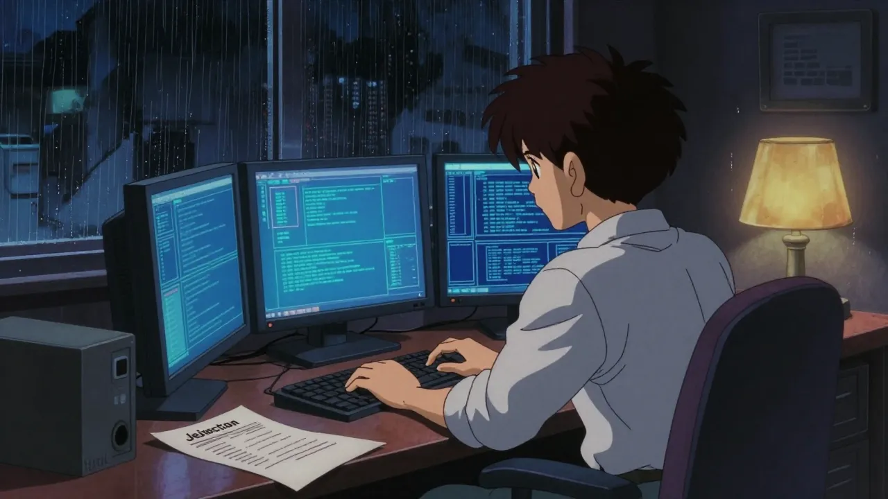
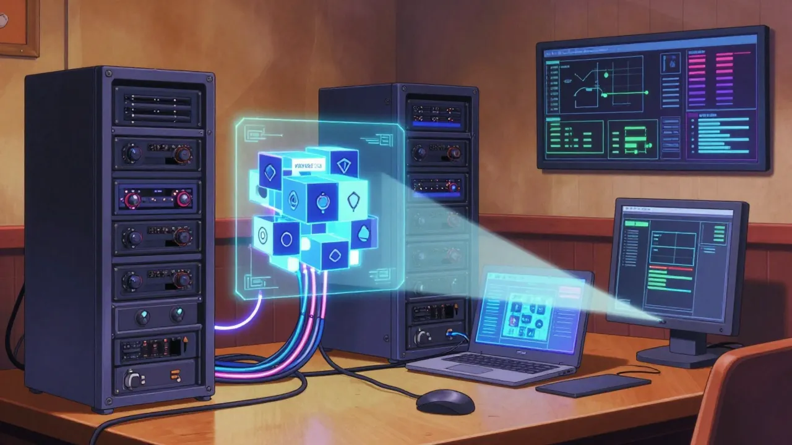
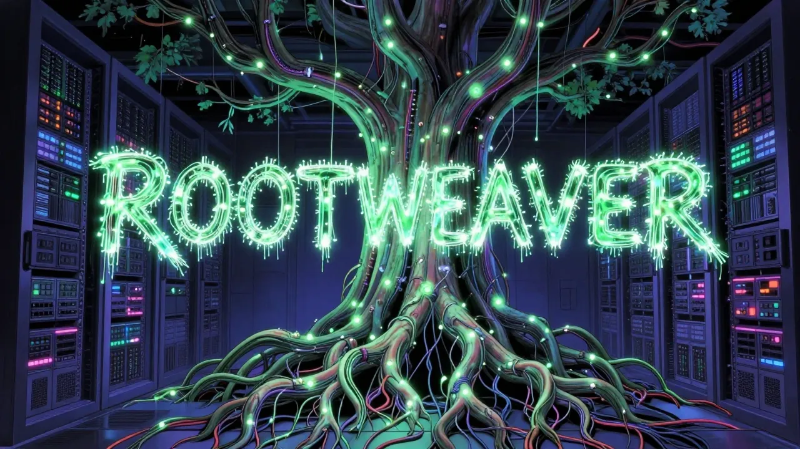
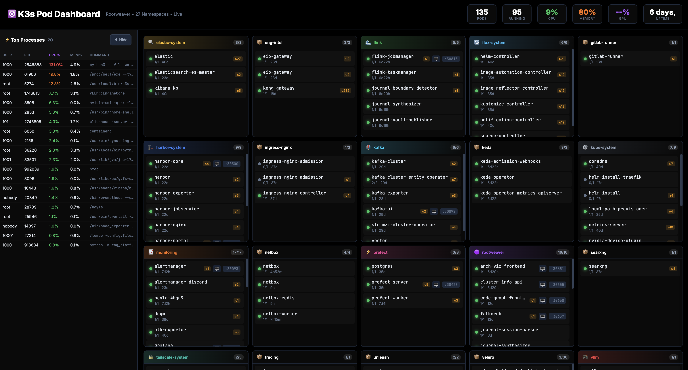
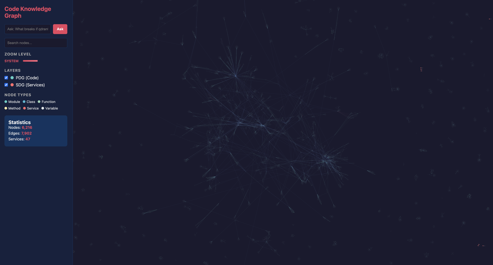
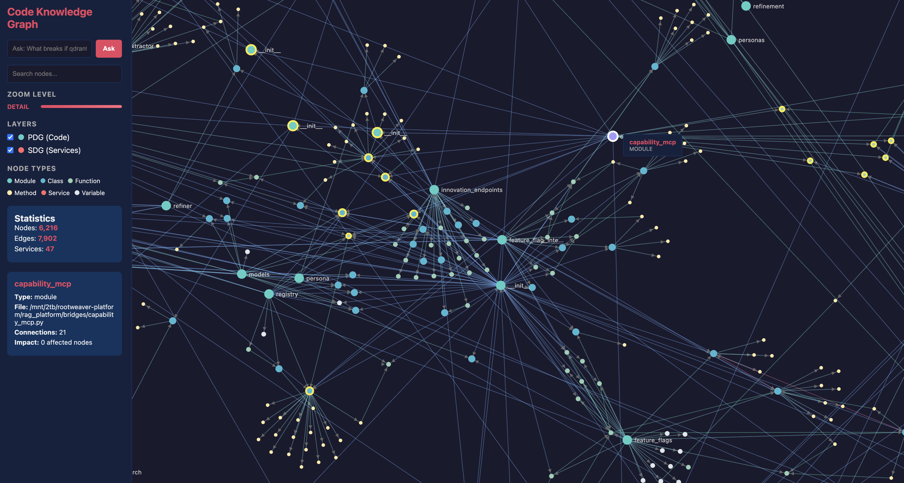

# Episode 1: From Side Project to Platform

**Series**: Season 3 - Platform Engineering in Public
**Episode**: 1 of 3
**Dates**: October 19, 2025 - January 25, 2026
**Reading Time**: 25 minutes

> *This post covers a lot of technical ground. If you hit a term you're not sure about, there's a [Glossary](#glossary) at the bottom with plain English explanations and links to learn more.*

```
    THE GAP
    ┌─────────────────────────────────────────────────────────────────┐
    │  Oct 18  Season 2 finale. 100/100. Perfect score.              │
    │  Oct 19  ...                                                    │
    │          ...                                                    │
    │          ... 3.5 months ...                                     │
    │          ...                                                    │
    │  Feb 7   You are here.                                          │
    │                                                                 │
    │  450 git commits happened in between.                           │
    └─────────────────────────────────────────────────────────────────┘
```

---

## The Silence



*Vault Evidence: `10-Blog/drafts/2026-01-05-Blog-Post-Multi-Agent-RAG-Architecture.md` (never published)*

Season 2 ended on a high. 100/100 Anthropic alignment. The neural vault humming with 38,380 documents. Multi-agent routing. Quality gates. Parallel execution. Episode 5 was literally written the afternoon after my SRE interview at BT — five hours of implementing Anthropic engineering patterns while the interview adrenaline was still wearing off.

The interview went well on networking and Linux — 7 years of BT ISP experience showing up when it mattered. But it exposed K8s gaps I didn't know I had. Architecture questions where I had the concepts but not the depth. I self-assessed 3.5 out of 5. Gave myself 60% odds of advancing.

The next week, I was still hopeful. Oct 20-24 was a research burst — Kafka architecture, K8s patterns, NER systems, all the things I wanted to go deeper on. 1,614 messages with Claude in a single day. Zero commits. Pure learning. Energy was high.

Then around November 4th, the feedback came. I didn't get the role.

That was a real kick in the teeth. I'd been investing heavily in my development at BT, pushing myself beyond my core role, trying to grow into SRE. To not pass the interview when you feel like you've been giving everything? That hits different.

But the worst part — and the best part — was that the feedback was fair. The K8s gaps were real. I knew it. That's the kind of failure you can't argue with. And honestly, that fairness is what made it useful.

Then I didn't write a single blog post for three and a half months.

```
  ┌─── ✦ ─── ✦ ─── ✦ ─── ✦ ─── ✦ ─── ✦ ─── ✦ ───┐
  │                                                   │
  │   Oct 18    blog goes quiet                       │
  │   Oct 20-24 research burst (1,614 messages/day)   │
  │   Nov 4     feedback lands                        │
  │   Nov-Dec   the real silence                      │
  │   Dec 28    something clicks                      │
  │                                                   │
  └─── ✦ ─── ✦ ─── ✦ ─── ✦ ─── ✦ ─── ✦ ─── ✦ ───┘
```

Here's what happened.

**The honest version?** The rejection landed harder than the interview itself. The research burst in late October? That was adrenaline — I was still waiting for the result, still hopeful. The real demotivation came after the feedback. Not the dramatic kind — I didn't quit or spiral. But the motivation to write publicly about the platform took a quiet hit. Why blog about building something when you just got told you're not ready? Day job at BT continued. Holidays happened. The Christmas period is basically a black hole for side projects. I had a Multi-Agent RAG blog post drafted on January 5th — 530 lines, performance benchmarks, the works — and never published it. A blog automation pipeline sitting idle.

It took some proper self-reflection to work through it. A week or so of thinking while doing other things. And the conclusion I came to was simple: the interview pointed to exactly what I needed to build.

But here's the part I need to give credit for: the feedback wasn't just a "no." It was constructive. Directed. Actionable. And what came after was something I didn't expect — my manager and the hiring manager recommended I reach out to individuals on the SRE team for mentoring. So I did. Shadowing people who were doing the work daily. Sitting in on calls, watching how the team operated, absorbing the patterns and thinking behind their decisions.

It started small. Just listening. Then I started contributing — asking questions in calls, picking up context, gradually building confidence in the subject areas the team was working on. That exposure changed how I think about infrastructure. Not just "how do I deploy this" but "how do I make this reliable, observable, recoverable." Without that support from my manager and the team who backed my development, I wouldn't be where I am today. The platform you're reading about in this post? Half the architectural decisions trace back to what I learned shadowing that team.

> *"Not just 'how do I deploy this' but 'how do I make this reliable, observable, recoverable.'"*

The system kept running. And growing. And eventually — running out of space.

**A quick note on how I work**, because this comes up a lot: I'm not a traditional programmer. I don't sit down and write Python functions line by line. What I do is orchestrate AI — multiple Claude Code sessions running in parallel, Perplexity for deep research, Claude for explaining concepts back to me until I actually understand them. When I say "I built X" in this post, what I mean is: I had a vision for X, researched it until I understood the architecture, and then directed a team of AI sessions to make it real. Think technical architect with an AI engineering team, not solo developer writing code. The 450 commits in this post? Every one of them was generated through AI sessions that I directed, reviewed, and steered toward my architectural goals.

---

## The Research Burst and the Real Silence

*Vault Evidence: Daily journals Oct 20-24, conversation summaries*

That Oct 20-24 research burst deserves a closer look, because the *how* matters as much as the *what*. This was before the rejection — I was still hopeful, still running on interview energy. The workflow: I'd throw a topic at Perplexity — "Kafka event streaming for ML pipelines", "K8s patterns for single-node clusters" — read the research summary, then feed it into Claude to explain it back to me. Back and forth. "Explain this like I'm designing the system, not implementing it." "What are the trade-offs?" "What would break first at scale?" Every concept got pressure-tested through conversation before a single line of code existed.

None of this produced a commit. It was all ideas being shaped through AI-assisted deep dives. The groundwork for everything that came next, except I didn't know it yet.

Then the feedback came, and the energy evaporated. A brief resurface on November 2nd for a network adapter migration (Ethernet to WiFi — riveting stuff). And then... nothing. The real silence. Nov 3 through Dec 27. Not just holidays — the quiet demotivation of knowing the gaps were real and not knowing what to do about them yet.

Spoiler: I figured it out. And it was messy.

---

## December 28-31: The Year-End Sprint That Changed Everything


*Vault Evidence: `03-AI-Conversations/2025-12-30-Claude-Session-Deployment-GitOps-Fixes.md`, `01-Inbox/2025-12-31-Full-Review-Past-3-Days.md`*

December 28th. Three days before the year ends. Something clicked.

I'd been thinking about the platform during the holidays — not building, just thinking. The kind of background processing your brain does when you're eating Christmas dinner but part of you is thinking about what the system could become — architectural improvements, what innovation looks like for a one-person platform, what to build next. (Just me? Probably just me.)

**December 29th** was not the warm-up I thought it was. Repository consolidation onto GitLab, token integration for automated access, FluxCD GitOps reconciliation — that was the infrastructure. But the real work was vault standardization: 2,044 markdown files processed, NER tag extraction using qwen2.5:14b running for 90 minutes, 18,400 tags generated, then a full ChromaDB reindex — 60,022 chunks at 3 files per second. Not fixing a broken pipeline — building one for the first time, and giving it something to index.

**December 30th** was the day everything changed.

In roughly four hours, I deployed the full platform MVP. Not a proof of concept — a complete K3s deployment with:

- RAG Platform: rag-gateway (2 replicas), rag-retriever, ChromaDB, MCP bridge, Ollama, vault-indexer
- 20+ innovations module features: temporal RAG, multi-hop reasoning, confidence scoring, semantic diff, knowledge gap detection, A/B testing, prefetch caching, federation
- 5 namespaces rebuilt from scratch: rag-platform, prefect, monitoring, ai-analytics, elastic-system

**2,057 files modified in one day.**

Was it clean? Absolutely not. The Claude Code session log reads like a war diary — me describing what's broken, Claude diagnosing and fixing, me validating, repeat. CrashLoopBackOff on the analysis engine — relative imports breaking inside Docker containers. K3s containerd caching old images. A Weaviate StatefulSet conflict. A 3.1GB VRAM leak from duplicate FastMCP processes. Twelve distinct deployment issues, each one debugged and fixed in sequence through that back-and-forth.

```
  Deployment Issue Log (Dec 30, 2025)
  ────────────────────────────────────
   1. Analysis Engine CrashLoopBackOff    → Relative imports → absolute
   2. K3s image pull failures             → containerd cache → direct import
   3. Bedrock configuration error         → Config mismatch → env vars
   4. TokenPruner API mismatch            → Version conflict → pinned deps
   5. Weaviate StatefulSet conflict       → Namespace collision → recreate
   6. YAML frontmatter missing            → Vault files → auto-fix script
   7. Duplicate FastMCP (3.1GB VRAM leak) → Process management → singleton
   8-12. Various namespace/DNS fixes      → One by one by one
```

**December 31st** brought two milestones. First: all local systemd services migrated into K3s — 6 Prefect deployments (journal automation, vault indexing, NER tagging, conversation compression, capture renaming, vault standardization) now running as K3s CronJobs instead of local services. Prefect UI on NodePort 30420, Unleash on 30424, accessible from both devices via Tailscale.

Second, and more quietly: **Qdrant went live.** This wasn't just swapping one database for another — it was a deliberate choice after researching what would actually scale. ChromaDB had served Season 2 well, but the question was: if this platform grew to enterprise scale, is this the right tool? The research said no. Qdrant's Rust-based async engine, binary quantization for ~96% RAM reduction, and payload indexing for temporal queries — that's what scales. This was the vector database that would eventually hold 148K+ documents and 328K vectors. ChromaDB's 38,380 documents from Season 2 were being superseded by something built for the next order of magnitude.

Full infrastructure validation. Year-end review. Everything green. I wrote a review document at 2am.

The realization hit somewhere around deployment issue #7: this isn't a side project anymore. This is platform engineering. And it needs to be treated like it.

---

## January 1-2: New Year, New Platform


*Vault Evidence: `09-System/Incidents/2026-01-01-ChromaDB-obsidian_vault-Collection-Corruption-RCA.md`, `02-Active-Work/2026-01-02-*.md`, `09-System/Architecture/Plans/2026-01-02-Strategic-Platform-Optimization-Plan.md`*

January 1st, 2026. I'd been in Norwich celebrating New Year's Eve with friends. The MacBook wouldn't arrive until January 3rd — a Christmas treat to myself, the escape-from-the-desk machine. But I had Termius on my phone and SSH access to the Desktop back home. While most people were recovering from the night before, I was dealing with a ChromaDB corruption incident from my phone — the `obsidian_vault` collection claiming to be 11.2TB (actual size: 5.4GB), throwing SIGSEGV crashes. Root cause: an interrupted HNSW index rebuild from December 30th left a write pointer at a ridiculous offset. Detected, diagnosed, and resolved same day. Happy New Year.

January 2nd was supposed to be the planning day. It became the everything day.

The plan came first: I asked Claude for an ULTRATHINK deep analysis of the platform's current state and gaps. It produced **11 strategic initiatives** across 5 phases. Estimated effort: 60-80 hours. The git commits later told a different story — 123 unique active hours across 24 days, and that's just commit activity. The actual time including research, conversations, and thinking was probably closer to double the original estimate. Plans are great. Reality doesn't read the plan.

But January 2nd wasn't just planning — it was a full infrastructure cleanup:

- **327GB of disk freed** (694G → 367G, 47% reduction). K3s PVC migration, Ollama model consolidation, Python environment cleanup, Docker/containerd cache purge, the ai-lab directory finally deleted. Not the 2TB NVMe install — that was the hardware fix. This was the software housekeeping that hardware alone can't solve.
- **RAM optimization**: Elasticsearch dropped from 16Gi to 6Gi, Ollama from 16Gi to 8Gi. 18GB of headroom recovered.
- **ChromaDB verified in K3s**: 960MB of data (388MB database + 141MB BM25 cache) confirmed safe after the Jan 1 corruption scare.
- **LibreChat namespace shut down**: Scaled to zero, PVCs retained. Resources freed for things that actually needed them.
- **Phase 5 Unified Agent Framework deployed**: Complexity-based routing on a 0-10 scale — simple queries go to FastSearch (<1s), complex ones escalate through DeepResearch, Oracle, and autonomous agents. Six deployment issues fixed in sequence (import paths, missing dependencies, image pull failures, FluxCD PVC validation).

That last bullet — Phase 5 — was supposed to be a future initiative. It shipped on day one. That's the power of Claude Code. When your implementation bottleneck isn't writing code but knowing what to build, you can move at the speed of architecture.

---

## The Disk Space Crisis

*Vault Evidence: `02-Active-Work/2026-01-02-Final-Migration-Cleanup-Summary.md`*

The catalyst behind all of this: the original drive was at 98% capacity.

K3s persistent volumes, Docker images, ML models, vector databases, embedding models — all fighting for space on a drive that was never meant to hold a production platform. I was deleting Docker build caches between deployments just to buy another 500MB.

The fix: a 2TB NVMe. But hardware is the easy part. The migration meant updating every hostPath PV, relocating git repos, updating all path references across the GitOps manifests, fixing K3s CNI plugin symlinks that broke during the move. The 327GB freed on January 2nd? That was the cleanup *after* the hardware was in. Turns out migrating to a bigger drive also means confronting every piece of technical debt you've been hoarding.

**The lesson I keep re-learning**: infrastructure grows faster than hardware planning. Plan your storage before you're deleting build caches at 2am.

---

## January 4: Configuration Architecture — The 96% Token Reduction

*Vault Evidence: `09-System/Architecture/2026-01-04-Configuration-Architecture-Design.md`*

This is the section where I went a bit... academic.

The problem: Claude Code's CLAUDE.md file had grown to a 64KB monolith. Every session loaded 25,000 tokens of context — most of it stale paths, outdated references, and duplicated documentation. My context window was being eaten alive before I'd even asked a question.

So I did what any reasonable person would do: I had Perplexity research configuration management across 160+ academic papers and 40+ industry sources, read the summaries, then went back and forth with Claude to understand the patterns and anti-patterns. "What does the research say about progressive disclosure for AI context?" "Which of these anti-patterns am I hitting?" "Show me the evidence."

**Fair warning**: that's not normal behaviour for a config file refactor. I don't recommend the rabbit hole. But I do recommend the result.

The research confirmed I'd hit 4 of the top 7 configuration anti-patterns identified in 2021 MLOps research:

1. **Monolithic configs** — one massive file trying to do everything
2. **Stale paths** — 21 references pointing to files that didn't exist
3. **No validation** — broken workflows going undetected
4. **Duplication** — the same documentation in 3 different places

The solution: **progressive disclosure**. Three layers:

```
  Layer 1: Quick Reference (~600 tokens)
  ├── Always loaded. Essential rules, paths, environment.
  │
  Layer 2: Context (On-demand)
  ├── Loaded when needed. Architecture, ADRs, detailed specs.
  │   Accessed via MCP vault search.
  │
  Layer 3: Deep Reference (Rare)
  └── Full documentation. HLD, LLD, implementation plans.
      Loaded only for architecture-level decisions.
```

**25,000 tokens down to 600 at startup. 96% reduction.**

Along the way, I fixed 21 stale paths and recovered 7 orphaned files from incomplete workflows. I also created 18+ Claude Code skills — custom commands like `/vault-search`, `/journal`, `/deploy`, `/load-arch` — each one a progressive disclosure mechanism. Need architecture context? Run `/load-arch`. Don't need it? Don't load it.

The key insight, and this is a callback to Episode 5: **configuration is product design when AI is the consumer**. You're not just writing docs — you're designing a user experience. The user just happens to be an LLM with a limited context window.

---

## January 5-15: The Infrastructure Sprint



*Vault Evidence: `09-System/Architecture/Plans/2026-01-05-vLLM-Migration-Plan.md`, `09-System/Architecture/2026-01-14-Multi-Device-Development-Setup.md`, `09-System/Performance/2026-01-14-System-RAM-Analysis.md`, `09-System/Architecture/Plans/2026-01-15-Harbor-Container-Registry-Deployment-Plan.md`*

The next ten days were pure infrastructure work. The kind of work that's boring to describe but essential to everything that follows.

**January 5: vLLM Migration kicked off.** This was a 22-day project that ran in the background through most of January. The goal: replace Ollama as the GPU inference engine with vLLM. The result, when it completed on January 27th: 3.2x throughput improvement (5-10 concurrent requests → 20-25), 40-50 tokens per second per request, P95 latency under 2 seconds (down from 5-10s with Ollama), and 85-90% GPU utilization. Zero pod restarts over 27 consecutive days. Ollama moved to CPU-only for auxiliary tasks. The GPU was finally doing one thing well instead of two things poorly.

**January 5-9: Observability stack.** Prometheus Phase 4 delivered 20 new metrics for the AgentRouter, bringing the total to 36 system metrics on a dedicated service (port 9402, <1ms overhead per query). OpenLIT added LLM-specific observability — token counts, latency distributions, model performance. Grafana dashboards. For the first time, I could actually *see* what the platform was doing instead of guessing from `kubectl logs`.

**January 6-7: Qwen3-Embedding-0.6B.** Moved from larger embedding models to Qwen3-0.6B running on CPU. Why? Because the RTX 4080 only has 16GB of VRAM, and vLLM was already claiming most of it. CPU embeddings freed the GPU for what matters — inference — while model pre-loading and fallback chains kept latency acceptable.

**January 9-11: The incident cluster.** Three incidents in three days: Promtail inotify resource limits, Bifrost OpenTelemetry tracing failure, FastMCP session initialization bug. Each one diagnosed, fixed, documented. Welcome to operating a platform.

```
  ─── week 2 ──────────────────────────────────────
   incidents: 3  │  RAM recovered: 11GB  │  devices: 2
  ─────────────────────────────────────────────────
```

**January 14: Two things happened.**

First, the RAM crisis. System memory hit 53GB out of 62GB — 81% utilization. Investigation revealed duplicate vault_indexer processes consuming 9GB (should have been 3GB), plus an orphaned `file_watcher.py` eating another 3GB. The embedding model (Qwen3-Embedding-0.6B) needed 2-3GB per process, and multiple processes had spawned. 11GB of savings identified and reclaimed. Same day: Qdrant index pollution incident — corrupted vectors from duplicate indexer processes, cleaned up.

Second, the multi-device mesh:

```
  ┌───────────────────────────────────────────────────────┐
  │           MacBook M4 Pro (Development)                 │
  │           Tailscale (private mesh IP)                   │
  ├───────────────────────────────────────────────────────┤
  │  Claude Code  │  ~/2tb/ (synced)  │  kubectl remote   │
  └───────────────────────┬───────────────────────────────┘
                          │
                 Tailscale WireGuard Mesh
                   (encrypted, ~25ms latency)
                          │
  ┌───────────────────────▼───────────────────────────────┐
  │           Desktop RTX 4080 (Compute)                   │
  │           Tailscale (private mesh IP)                    │
  ├───────────────────────────────────────────────────────┤
  │  MCP Bridge   │  K3s API :6443  │  RTX 4080 16GB     │
  │  Qdrant 328K  │  vLLM           │  Prefect            │
  │  /mnt/2tb/rootweaver-platform (source of truth)       │
  └───────────────────────────────────────────────────────┘
```

MacBook M4 Pro for development. Desktop RTX 4080 for compute. Connected via Tailscale WireGuard mesh with ~25ms latency. Syncthing keeps ~2-3GB of code in sync while excluding ~470GB of models, databases, and K3s storage.

The killer feature: MCP tools over Tailscale. 15 AI tools running on the Desktop, accessible from the MacBook at ~100-200ms per call. Vault search from the couch. `kubectl` from the couch. GPU inference from the couch.

**January 14-15: Qdrant scaled up.** The migration had completed on December 31st, but now the index was growing — 148K+ documents, 328K vectors, Qwen3-Embedding-0.6B at 1024 dimensions. The collection name is still `leveling_life_qwen3`. Renaming it would mean reindexing 328K vectors. Pragmatism beats perfection.

**January 15: Harbor Container Registry** — planned and deployed in a single day. Pull-through cache proxying five upstream registries (Docker Hub, GHCR, Quay, K8s, NVIDIA), NodePort 30500. No more rate-limited pulls from Docker Hub during deployments. Nine pods running by end of day.

---

## January 13-25: The Birth of the ADR (and EIP)

*Vault Evidence: EIP architecture docs, `eng-intel-platform/docs/adr/`, Code Graph visualization*

January 13th was the second SRE interview. I'd listened to the feedback from the first one and done the prep work — properly this time.

The prep started on January 9th. I built a question bank — 30+ technical and behavioural questions, covering K8s, Linux, networking, observability, and the competency framework. Then a weekend checklist: Saturday morning was K8s control plane drilling with Claude Code — drawing the architecture from memory, explaining each component out loud. Saturday afternoon was STAR stories practiced verbally, scored out of 10. Sunday was mock interviews and technical Q&A. I created a flashcard system mapping every possible interview question to a specific story, with a quick-match decision guide so I wouldn't freeze up when a question landed differently than expected.

The morning of the interview: 07:00-08:30, Claude Code rapid fire — K8s questions, STAR practice, last-minute flashcard review. Then the Mac's dictation feature to practice verbal responses, hearing myself explain things out loud instead of just reading answers on a screen. By 10:00 AM, I'd done more structured prep in four days than I'd done in the month before the October attempt.

The difference showed:

| | October 2025 | January 2026 |
|--|--|--|
| K8s Architecture | Struggled | Confident |
| STAR Delivery | Scripted | Natural |
| Technical Gaps | Multiple | One |
| Interviewer Feedback | Gaps obvious | *"Proper preparation"* |

The post-interview feedback: 60-70% improvement from last time. But there was one comment that stuck with me — the kind of feedback that's more valuable than a score: *"You're clever — using your own mind rather than relying on AI too much would be better for exams."* That tension is real. AI is incredible for prep — drilling, testing, building confidence. But in the room, you have to deliver it yourself. The prep gave me the foundation. I delivered it as me.

```
  ─── meanwhile, on the platform ──────────────────
```

But it was also the day something quieter happened — something that mattered just as much for the platform.

I wrote my first Architecture Decision Records. Five of them. In one day.

ADR-001: Capability-Based Architecture. ADR-002: Kong API Gateway. ADR-003: Feature Flags with Unleash. ADR-004: Event Streaming with Kafka. ADR-005: Observability Stack.

Five foundational decisions, formally documented — context, consequences, alternatives considered. Not scribbled in a journal. Not buried in a Claude Code session transcript. Proper ADRs, the way production engineering teams govern architecture.

Before January 13th, I was making decisions and just... building. After January 13th, every significant architectural choice got documented. Why we chose Kong over Traefik. Why Kafka over RabbitMQ. Why capability-based architecture instead of monolithic endpoints. The kind of engineering rigour I'd been absorbing from shadowing the SRE team — now showing up in my own platform.

By month end: 12 ADRs. Branching strategy. Domain naming conventions. Journal automation architecture. Code knowledge graph visualization. The platform wasn't just getting bigger. It was getting governed.

The timing wasn't a coincidence. The same discipline that helped me show growth in the interview was reshaping how I treated the platform. ADRs aren't boring — they're brainstorming sessions captured in writing. Each one is an innovation branch, a point where the platform could have gone a different direction. Documenting the *why* behind each decision isn't governance for the sake of governance. It's how a side project develops a memory.

```
  ADRs Written (Jan 13-25)
  ────────────────────────────────────────────────
   001  Capability-Based Architecture
   002  Kong API Gateway
   003  Feature Flags (Unleash)
   004  Event Streaming (Kafka)
   005  Observability Stack
   006  Domain Consolidation
   007  Naming Conventions
   008  Trunk-Based Development
   009  Classification System
   010  ...011 ...012 — and counting
  ────────────────────────────────────────────────
```

The Engineering Intelligence Platform (EIP) had its own breakthrough that same week. I'd been building three separate projects — one for deployment intelligence, one for automated release notes, and a workflow orchestrator. The architectural thinking kicked in: why build three things when the existing 5-stage capability pipeline could absorb them all? ADR-006 (Domain Consolidation) and ADR-007 (Naming Conventions) documented the decision. Three projects became two new EIP domains — Delivery for CI/CD analysis and deployment readiness, Release for automated notes and Confluence publishing. The original estimate: 8,500 lines of code across 12 weeks. After consolidation: 2,000 lines in 4 weeks. 75% less code by reusing infrastructure that already existed.

---

## January 18: The Rebrand



*Vault Evidence: `09-System/Architecture/2026-01-18-Rootweaver-Rebrand-Complete.md`, conversation archives*

This is the climax. The moment the side project earned a name.

**Rootweaver.**

The platform had been called "Leveling-Life" since Season 1. A fine name for a personal project. Not a great name for something running 30+ services across a K3s cluster with multi-device development, GitOps, and production-grade observability.

The naming came out of a brainstorming session with Claude. I typed a single word — "rootweaver" — and Claude unpacked what my subconscious had already assembled. **Root**: the foundation, Yggdrasil's roots binding the nine worlds together in Norse mythology. The part of the system you don't see but everything depends on. **Weaver**: the one who creates fabric from threads, like the Norns weaving fate. Taking disparate knowledge — vault documents, conversations, architecture decisions, code — and weaving them into something coherent. Root + Weaver. Foundation that connects.

We explored variations — Rootloom, Groundweave, Deepweaver, Worldweaver, Mycelium — but none of them stuck the way the original did. Then I shifted the conversation practical: does it work as a namespace? Is it clear in API paths? Can you read it in code without confusion? `rootweaver-platform`, `rootweaver` namespace, `/rootweaver/api/v1/` — clean, no ambiguity. The name that started as mythology passed the engineering test.

The scope of the rename:

- Directory: `/mnt/2tb/leveling-life` → `/mnt/2tb/rootweaver-platform`
- K3s namespace: `rag-platform` → `rootweaver`
- 33 GitOps manifests updated
- 4 service DNS records changed
- Claude Code environment variables, aliases, rules — all updated
- Backward compatibility: 30-day symlink, aliased env vars (`LEVELING_LIFE_HOME` → `ROOTWEAVER_HOME`)

Same day, ADR-008 (trunk-based development) and ADR-009 (classification system) joined the growing registry. Twelve ADRs and counting — the governance matched the ambition.

What *didn't* change: the Qdrant collection name. `leveling_life_qwen3` with 148K+ docs. Cosmetic rename not worth the reindex. Some battles aren't worth fighting.

The rebrand wasn't vanity. It was formalization. When you're managing 33 GitOps manifests and your "side project" has its own namespace, CI/CD pipeline, and observability stack — it's not a side project anymore. It deserves a name that reflects what it is.

Now I'm naming my platform. Something I built.



But more than that — I wanted the name to *mean* something. I'd poured countless hours of my life into this system. Late nights, early mornings, holidays spent debugging instead of resting. If it was going to have a name, that name needed to stick in people's minds. It needed to capture what I'd actually built.

"Root" works on two levels. There's the Linux root — system-level access, the foundation everything runs on, the user that controls the entire machine. But there's also the root of a tree. Something that starts underground, unseen, weaving its way through the soil. Spreading. Connecting. And that's the "weaver" part — the way roots thread through dirt, finding water, finding nutrients, building a network beneath the surface that eventually grows into something beautiful above it. That's what this platform does. It weaves knowledge together — vault documents, conversations, architecture decisions, code, search — all these threads connected underground. And over time, it grows into something real. Something you can see.

And honestly? Three months earlier, an interview had told me I wasn't ready. Now I was naming a platform. The K8s gaps that got exposed in October? Filled — not through flashcards, but through building the thing that required me to learn it properly.

Five days before the rebrand, I got a second shot at the role. The feedback: significant improvement across the board. K8s architecture — struggled in October, confident in January. Technical gaps went from multiple to just one. The comment that stuck with me: *"You can see that you have done proper preparation."*

The preparation was this platform. Every section of this blog post. Not because the failure forced my hand — but because I realised that if you want something in life, you have to put in the work to get it. Nobody's going to do it for you. You have to be ambitious. Hungry for something more. And then you have to back that hunger up with the hours.


---

## January 20-25: The Cleanup After the Party

*Vault Evidence: `09-System/Infrastructure/2026-01-21-Traefik-Migration-Complete.md`, `09-System/Architecture/2026-01-24-HLD-LLD-Source-of-Truth-Migration.md`, `09-System/Architecture/2026-01-25-Code-Knowledge-Graph-Project.md`*

The rebrand was the headline. The week after was the unglamorous cleanup that made it real.

**January 20-21**: NetworkPolicy incident from a Kustomize bug — Harbor registry traffic blocked by overly aggressive default-deny rules. Fixed, then used the momentum to migrate from nginx-ingress to Traefik as the cluster's ingress controller. Same day, killed a zombie Beyla process that had been eating 12.5% CPU for five days straight. And nvidia-smi polling for 380+ hours at 4.6% CPU. The kind of resource waste you only find when you actually look.

**January 24**: The documentation reckoning.

```
  HLD + LLD Cleanup
  ──────────────────────────────────────────────
   10,837 lines updated across 2 files:
   ├── Branding:   Leveling-Life → Rootweaver
   ├── Paths:      /home/rduffy/  → /mnt/2tb/
   ├── Namespace:  rag-platform   → rootweaver
   ├── GitOps:     repo name updated
   └── Vectors:    collection references updated
  ──────────────────────────────────────────────
```

This is the kind of work nobody sees and everyone benefits from. Including future-me reading these docs at 2am during an incident. That mindset — documentation for the person responding at 2am — comes straight from my day job. I deal with incidents most days in operations at BT. After enough of them, you stop thinking "this documentation is good enough" and start thinking "will this make sense when I'm tired, stressed, and something is on fire?" I've taken that operational discipline and applied it to my own homelab. Same rigour, same standards.

**January 25**: Code Knowledge Graph shipped. This one deserves more than a bullet point.

The problem it solves: "If I change this file, what else breaks?" In a platform with 447 Python files across multiple repos, you can't hold the dependency tree in your head. So I built a system that holds it for you.



It's three layers deep:

```
  Layer 1: PDG (Program Dependency Graph)
  ├── Parses Python AST → maps imports, calls, inheritance
  ├── Calculates "blast radius" — change one file, see everything affected
  └── 5-phase build: parse → imports → calls → inheritance → containment

  Layer 2: SDG (Service Dependency Graph)
  ├── Parses K3s YAML manifests → maps service dependencies
  ├── mcp-bridge → rag-gateway → rag-retriever → {qdrant, ollama}
  └── Discovers connections from env vars, DNS, HTTP URLs, ConfigMaps

  Layer 3: Journey Tracer (E2E Impact Mapping)
  ├── Combines PDG + SDG → traces full request flows
  ├── "What code runs at each service when a user searches?"
  └── Risk scoring: affected modules (40%) + critical paths (30%) + services (30%)
```



The frontend is a D3.js force-directed graph with semantic zoom — zoom out to see the system level, zoom in to see individual functions. Impact heatmaps light up when you hover over a node, showing the blast radius of a change. Natural language queries ("what depends on the router?") go through FalkorDB, the graph database running on K3s at NodePort 30637. The whole thing is served by an nginx pod at NodePort 30650 and also deployed to GitLab Pages for CI/CD integration.

<video controls width="100%" preload="metadata">
  <source src="/videos/code-graph-demo.mp4" type="video/mp4" />
  Your browser does not support the video tag.
</video>

42 commits in three days. And this was the day-job crossover moment. I'd seen deployment visibility problems at BT — the kind where you're deploying network services and can't easily trace what changed, when, or why. "If this service goes down, what else fails?" is a question I hear in operations regularly. So I built tooling on the homelab to answer it — then took the patterns back to work. The platform feeding the day job. The day job feeding the platform.

---

## What Worked

**Strategic planning before execution**: The January 2nd ULTRATHINK session — 11 initiatives, 5 phases — gave structure to what could have been chaotic. The plan estimated 60-80 hours. Reality took double that. But every initiative completed. Not every plan survives contact with reality, but this one did.

**Progressive disclosure**: 96% token reduction isn't just a number. It's the difference between Claude Code understanding your codebase and Claude Code drowning in stale context. Layer 1 for every session. Layer 2 when you need it. Layer 3 for architecture decisions. Your AI tooling deserves the same UX thinking you'd give a human user.

**The year-end sprint**: December 28-31 set the tone for everything in January. Momentum matters. The platform MVP deployment was chaotic, but it proved the infrastructure could handle production workloads. Without that proof, the January strategic plan would have been aspirational instead of actionable.

---

**Multi-device development**: MacBook for flow state. Desktop for compute. Connected by WireGuard. This setup changed how I work. Debugging from the couch with full GPU access isn't a luxury — it's a workflow improvement.

**The day-job feedback loop**: Operations experience shaped the platform. The platform shaped how I approached the second interview. Incident documentation discipline, K8s architecture knowledge, structured prep systems — the homelab and the day job stopped being separate things and started reinforcing each other. That loop is still running.

---

## What Still Sucked

**3.5 months without blogging**: 450 commits. Zero blog posts. A drafted Multi-Agent RAG post gathering dust. Building without reflecting means you lose the narrative. Half the insights from this period were reconstructed from vault evidence because I didn't write them down when they were fresh.

**The Qdrant collection name**: `leveling_life_qwen3` is going to outlive me. Naming things is hard. Renaming 328K vectors is harder. This is my permanent reminder that naming decisions in data systems are basically permanent.

**Disk planning should happen before crisis**: Running a K8s cluster on a 1TB drive at 98% capacity is ambitious in the wrong direction. The 2TB migration went smoothly — but only because nothing corrupted at 98% capacity. That's luck, not planning. Don't be past-me.

**The 24-day holiday gap**: Nov 3 to Dec 27. Momentum died. The Dec 28 sprint had to restart everything from scratch — not technically, but mentally. Getting back into a codebase after 24 days is like reading someone else's code. Except that someone else is past-you, and past-you didn't leave comments.

---

## The Numbers (Oct 19, 2025 — Jan 25, 2026)

| Metric | Value |
|--------|-------|
| **Git commits** | 450 across 3 repos |
| **Blog posts published** | 0 (oops) |
| **Strategic initiatives** | 11 (all complete) |
| **Storage migration** | 1TB → 2TB (327GB freed in cleanup) |
| **Token reduction** | 25,000 → 600 (96%) |
| **Stale paths fixed** | 21 |
| **Orphaned files recovered** | 7 |
| **Skills/commands created** | 18+ |
| **Implementation plans** | 8 |
| **ADRs written** | 12 |
| **GitOps manifests (rebrand)** | 33 |
| **Qdrant vectors** | 328K |
| **Documents indexed** | 148K+ |
| **Platform MVP features** | 20+ |
| **Files modified Dec 30** | 2,057 |
| **K3s namespaces rebuilt** | 5 |
| **Devices in mesh** | 2 (MacBook + Desktop) |
| **Syncthing sync** | ~2-3GB (470GB excluded) |
| **CI/CD testing layers** | 4 |
| **RAM recovered** | 18GB (Elasticsearch + Ollama right-sizing) |
| **Incidents resolved** | 10+ (ChromaDB corruption to alert storms) |
| **Vault files standardized** | 2,044 (with 18,400 NER tags) |
| **ChromaDB chunks reindexed** | 60,022 |
| **vLLM throughput improvement** | 3.2x (22-day migration) |
| **Prometheus metrics** | 36 (20 new for AgentRouter) |
| **HLD/LLD lines updated** | 10,837 (rebrand cleanup) |
| **Prefect flows migrated to K3s** | 6 |
| **Harbor proxy registries** | 5 (Docker Hub, GHCR, Quay, K8s, NVIDIA) |
| **Backward compat period** | 30 days |

---

## What I Learned

```
         ╭──────────────────────────────╮
         │     THE SETBACKS             │
         │     where the roots start    │
         ╰──────────────────────────────╯
```

**1. Failing the interview was the best thing that happened.**
Not the disk space. The interview. Not passing the interview when you've been investing everything into growing — that's a kick in the teeth. The research burst after was adrenaline, not recovery. The real processing came later, quietly, during the dead zone. But the conclusion was simple: if you want something, you have to earn it. The interview pointed to exactly what I needed to build. The mentoring that followed gave me the right lens. Three months later, I got a second shot — and the growth was undeniable. Not because the failure forced my hand, but because I decided to be hungry for something more and back it up with the hours.

**2. Running out of disk space was the second best thing that happened.**
It forced systematic infrastructure planning. Without the 1TB crisis, I'd still be patching things incrementally instead of thinking about storage architecture, backup strategies, and capacity planning. Constraints create structure.

> *"Nobody's going to do it for you. You have to be ambitious. Hungry for something more. And then you have to back that hunger up with the hours."*

```
         ╭──────────────────────────────╮
         │     THE SYSTEMS              │
         │     where the roots spread   │
         ╰──────────────────────────────╯
```

**3. Configuration is product design when AI is the consumer.**
This is a callback to Episode 5, but it got real in January. A 64KB CLAUDE.md isn't a configuration file — it's a bad user experience. Progressive disclosure isn't just an academic concept. It's the difference between your AI assistant understanding your codebase and your AI assistant spending 25K tokens on stale paths before it even starts working.

**4. Multi-device development is the future of homelab.**
MacBook for flow state, Desktop for compute. It sounds obvious, but the implementation matters. Tailscale for networking. Syncthing for file sync. MCP tools over the mesh. The split isn't just about hardware — it's about matching the tool to the task. You don't need a GPU to write code. You do need a GPU to run inference.

**5. Year-end sprints set the tone for the year ahead.**
December 28-31 produced more momentum than the entire month of November. That momentum carried through January. The platform MVP wasn't just a deployment — it was proof that the infrastructure worked. Everything after that was building on confidence, not hope.

> *"The future of building software isn't 'learn to code' — it's 'learn to architect and orchestrate.'"*

```
         ╭──────────────────────────────╮
         │     THE MINDSET              │
         │     where the roots surface  │
         ╰──────────────────────────────╯
```

**6. You don't need to be a programmer to build a platform.**
450 commits. Zero written by hand in the traditional sense. Every one came through AI sessions I directed — Claude Code for implementation, Perplexity for research, Claude for architecture discussions. My value wasn't writing the code. It was knowing what to build, why, and catching when the AI went off-track.

**7. 450 commits with zero blog posts means you're building but not reflecting.**
Building is necessary. Reflecting is what turns experience into knowledge. This episode exists because I finally sat down and traced three months of work through vault evidence, git logs, and conversation transcripts. Half the insights were new — I didn't see them when I was in the middle of it.

> *"Name things when they've grown beyond what you first imagined them to be."*

**8. Name things when they earn it.**
"Leveling-Life" was fine for a personal project. But at some point, I'd poured enough hours, enough late nights, enough of myself into the system that it deserved a real name. Rootweaver wasn't a marketing exercise — it was recognition. When something you built has its own namespace, its own CI/CD pipeline, its own observability stack, and its own architecture decision records — calling it by a throwaway name stops making sense.

---

## Final Word


It's an amazing time to be alive.

What once wasn't possible is now possible. What used to take a team of ten and six months can be built by one person with a vision and the right tools. If you can imagine it — if you can think it — you can make it reality in software. Whether that's something small like a script that saves you 20 minutes a day, or something large like a platform running 30+ services on a K3s cluster in your living room.

Your imagination is your only limitation. And with AI, that's not a motivational poster — it's a technical fact. The barriers that kept software engineering behind a gate of years of training and computer science degrees are falling. Not gone — you still need to understand what you're building and why. But the gap between "I have an idea" and "I have a working system" has never been smaller.

This platform exists because AI made it accessible to someone like me. Not a traditional programmer. An engineer with ambition and the hunger to build something real.

If you're reading this and thinking "I could never build something like that" — you're wrong. You just haven't started yet.

---

## What's Next

But the platform transformation was just the foundation. What I built *on* that foundation — a streaming journal pipeline that turns every Claude Code session into a daily reflection, powered by Kafka, vLLM, and KEDA — that's the next story.

**Episode 2: "Streaming Journals: Kafka Meets LLMs"**

The original journal system from Season 2 used Prefect flows and K8s CronJobs. Single-pass. Worked fine when sessions were small. But when you're running 6 Claude Code sessions per day across 2 devices, producing 50,000 to 290,000 tokens per session — cron jobs don't cut it.

KEDA autoscaling that fired 1,400 pods per day instead of 2-3. An LLM that lost its voice and started writing like a LinkedIn influencer. A context preservation fix that went from capturing 15% of useful information to 85%.

Fair warning: that system still has bugs. Episode 2 is honest about them.

---

## Built on Open Source

This episode wouldn't exist without:

**[K3s](https://k3s.io/)** — Lightweight Kubernetes that makes single-node clusters actually usable. The backbone of everything.

**[FluxCD](https://fluxcd.io/)** — GitOps controller that turns git commits into deployed infrastructure. 362 of those 450 commits went through Flux.

**[Qdrant](https://qdrant.tech/)** — Vector database that scaled where ChromaDB couldn't. 328K vectors and counting.

**[Tailscale](https://tailscale.com/)** — WireGuard mesh that makes multi-device development feel like a single machine.

**[Syncthing](https://syncthing.net/)** — File synchronization that keeps 2-3GB of code in sync across devices without touching the cloud.

**[vLLM](https://vllm.ai/)** — High-performance LLM serving that let me move GPU inference to a proper framework.

Massive thanks to all maintainers. Your work enables platforms like Rootweaver.

---

*This is Episode 1 of "Season 3: Platform Engineering in Public" — documenting the 3.5-month transformation from hobbyist AI project to production platform engineering.*

*Previous Episode*: [From Interview to Implementation: Perfect 100/100 Anthropic Alignment](/posts/season-2-episode-5)
*Next Episode*: [Streaming Journals: Kafka Meets LLMs](/posts/season-3-episode-2) *(coming soon)*
*Complete Series*: [Season 3](/tags/season-3/)

---

## Glossary

New to some of these terms? Here's a quick reference for everything mentioned in this post, with links to learn more.

| Term | What It Is |
|------|-----------|
| **[K3s](https://k3s.io/)** | Lightweight Kubernetes distribution. Think of it as a way to run containerised applications on a single machine with the same tools used by large companies. |
| **[Kubernetes (K8s)](https://kubernetes.io/)** | Container orchestration platform. Manages how applications are deployed, scaled, and kept running. K3s is the lightweight version. |
| **[FluxCD](https://fluxcd.io/)** | GitOps controller. Watches a git repository for changes and automatically applies them to your cluster. Push code → infrastructure updates itself. |
| **[GitOps](https://opengitops.dev/)** | Managing infrastructure through git commits instead of manual commands. The git repo is the source of truth. |
| **[Qdrant](https://qdrant.tech/)** | Vector database. Stores documents as mathematical embeddings so you can search by meaning, not just keywords. |
| **[ChromaDB](https://www.trychroma.com/)** | Another vector database — simpler, great for getting started. Rootweaver used it in Season 2 before migrating to Qdrant. |
| **[Tailscale](https://tailscale.com/)** | Mesh VPN built on WireGuard. Connects devices securely as if they're on the same local network, wherever they are. |
| **[Syncthing](https://syncthing.net/)** | Peer-to-peer file synchronisation. Keeps folders in sync across devices without a cloud service. |
| **[vLLM](https://vllm.ai/)** | High-performance LLM serving engine. Runs large language models on your GPU with optimised throughput. |
| **[Ollama](https://ollama.com/)** | Easy-to-use LLM runner. Download and run AI models locally with one command. |
| **[Claude Code](https://docs.anthropic.com/en/docs/claude-code)** | Anthropic's CLI tool for coding with Claude. The AI assistant used to build most of this platform. |
| **[MCP](https://modelcontextprotocol.io/)** | Model Context Protocol. A standard for connecting AI assistants to external tools and data sources. |
| **[Prefect](https://www.prefect.io/)** | Workflow orchestration platform. Schedules and manages automated tasks (like journal generation, vault indexing). |
| **[KEDA](https://keda.sh/)** | Kubernetes Event-Driven Autoscaling. Automatically spins up pods in response to events (like new messages in a queue). |
| **[Kafka](https://kafka.apache.org/)** | Distributed event streaming platform. Handles high-throughput message passing between services. |
| **[Prometheus](https://prometheus.io/)** | Monitoring and alerting toolkit. Collects metrics from your services so you can see what's happening. |
| **[Grafana](https://grafana.com/)** | Visualisation platform. Turns Prometheus metrics into dashboards and graphs. |
| **[Harbor](https://goharbor.io/)** | Container registry with pull-through cache. Stores Docker images locally so you don't hit rate limits. |
| **[D3.js](https://d3js.org/)** | JavaScript library for data visualisation. Powers the Code Knowledge Graph's interactive force-directed graphs. |
| **[FalkorDB](https://www.falkordb.com/)** | Graph database. Stores relationships between code components for natural language queries. |
| **ADR** | Architecture Decision Record. A document that captures why a technical decision was made, what alternatives were considered, and what the consequences are. |
| **NodePort** | A Kubernetes service type that exposes a port on the host machine (range 30000-32767), making it accessible from outside the cluster. |
| **Pod** | The smallest deployable unit in Kubernetes. Usually runs one container (one application or service). |
| **Namespace** | A way to organise resources in Kubernetes. Like folders for your cluster — keeps different projects separated. |
| **StatefulSet** | A Kubernetes resource for applications that need persistent storage (databases, queues). Unlike Deployments, pods keep their identity and data across restarts. |
| **CronJob** | A Kubernetes resource that runs a task on a schedule (like cron on Linux). Used for batch processing and maintenance tasks. |
| **RAG** | Retrieval-Augmented Generation. A pattern where an AI searches a knowledge base before generating a response, grounding it in real data. |
| **Embedding** | A mathematical representation of text as a vector (list of numbers). Similar texts have similar vectors, enabling semantic search. |
| **VRAM** | Video RAM. Memory on a GPU. LLMs need significant VRAM to run — the RTX 4080 has 16GB. |
| **NVMe** | Fast solid-state storage that connects directly to the motherboard. The 2TB drive that solved the disk space crisis. |
| **SSE** | Server-Sent Events. A protocol for streaming data from server to client. How the MCP bridge communicates with Claude Code. |
| **WireGuard** | Modern VPN protocol. Fast, simple, and secure. Tailscale is built on top of it. |
