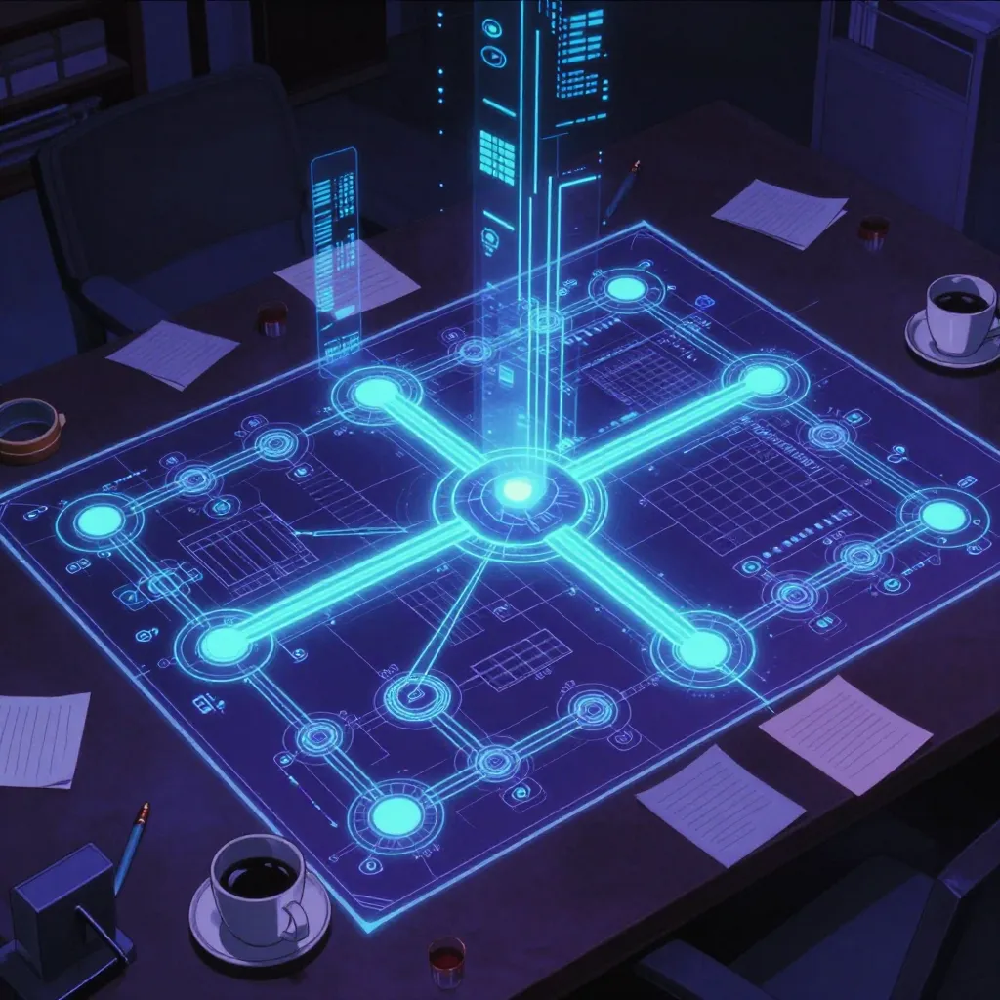
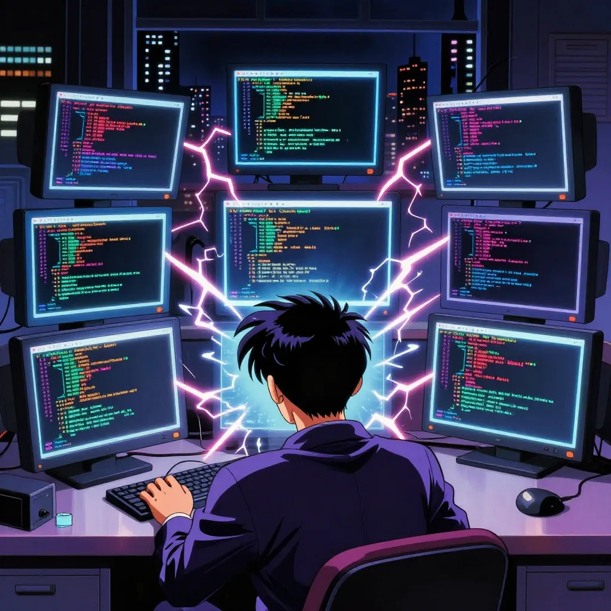
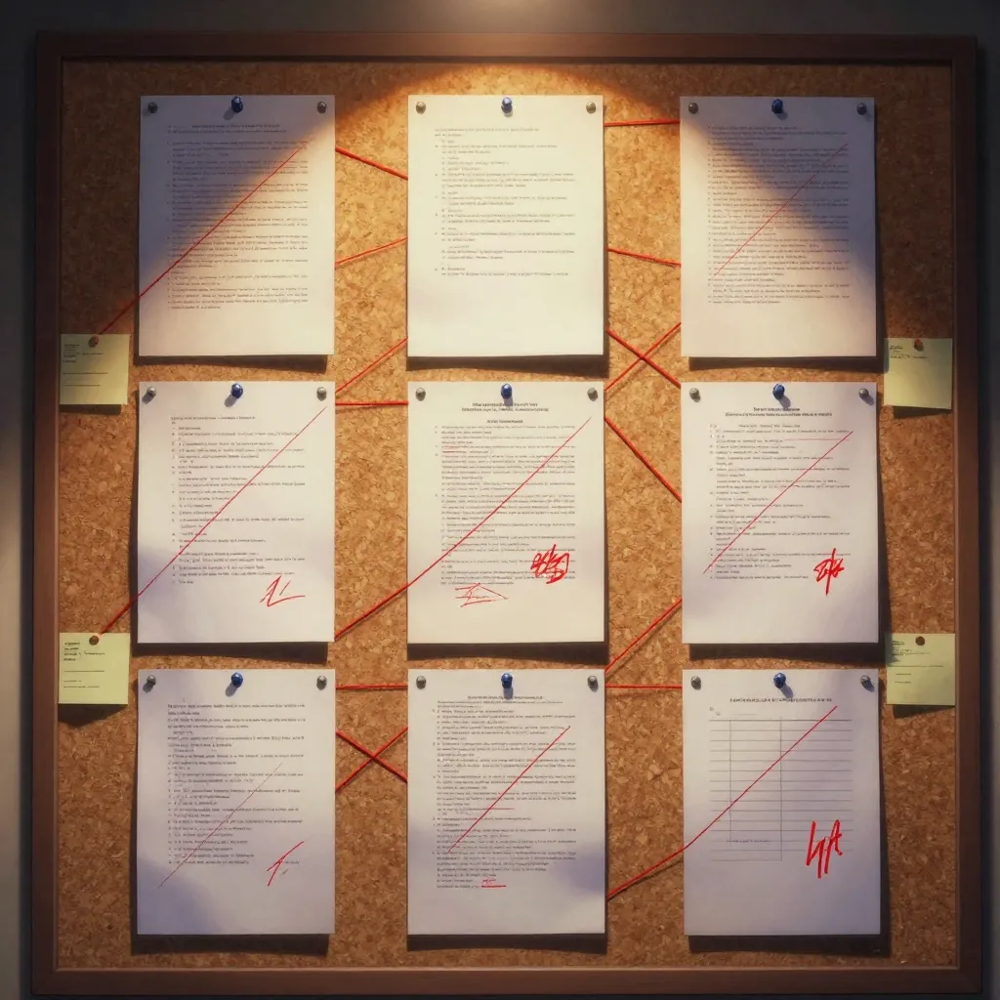
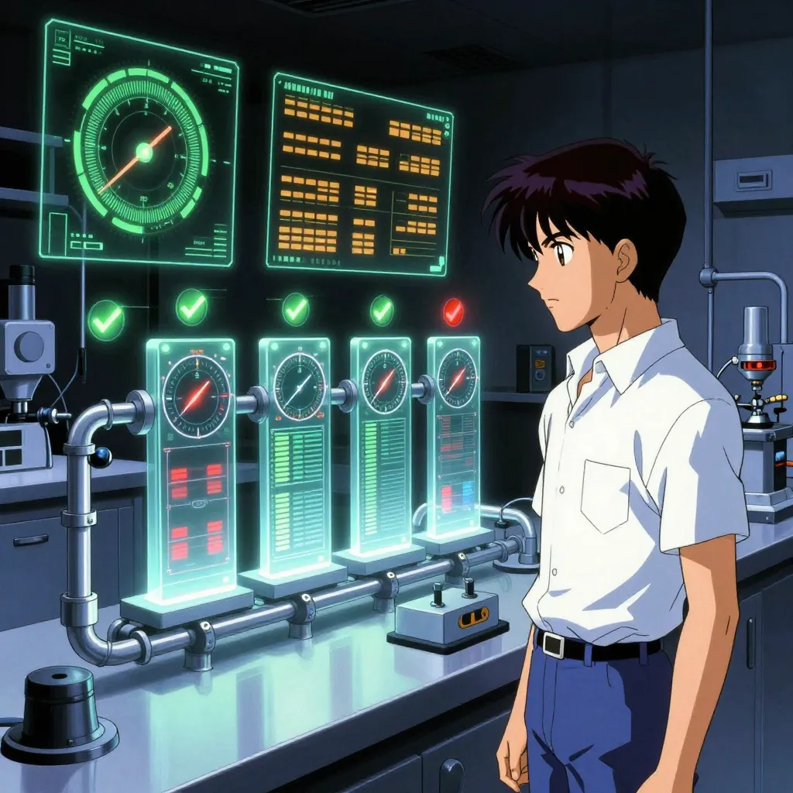

# Episode 2: Streaming Journals — Kafka Meets LLMs

**Series**: Season 3 - Building in Public (Oct 2025 — Feb 2026)
**Episode**: 2 of 5
**Date**: January 26 — February 9, 2026
**Reading Time**: 25 minutes

---

## 🤥 The Journals Were Lying


February 8th. I'm reviewing a journal entry from a Claude Code session where I'd spent the afternoon writing the Season 3 Episode 1 blog post and generating retro anime images via HuggingFace.

The automated journal entry said I'd been debugging `deploy_watchdog.sh`, doing CI pipeline integration, and troubleshooting Docker exit codes across four consecutive entries.

**None of that happened.** Not a single word of the journal was true.

I cross-referenced the JSONL transcript against the journal output. The voice was mine — the v8 prompt redesign had nailed the tone. The format was perfect. But the content was entirely fabricated. My automated journal system was writing fiction in my voice.

*Git evidence: commit `41d1680` (Feb 8) — "fix(journal): add hallucination guard to synthesizer v9" — this commit exists because of what I found that day.*

That's worse than not having journals at all.

## 📆 Where Episode 1 Left Off

Episode 1 ended on January 25th. The Code Knowledge Graph had just shipped — 42 commits in 3 days, D3.js force-directed visualisation, FalkorDB integration. Rootweaver had 30+ services running across K3s. Twelve ADRs documented. Everything was humming.

But I'd been ignoring the journal system. The Prefect-based `journal-automation-v3` was running daily via CronJob, producing entries that looked passable at a glance. I hadn't actually read one properly in weeks.

On **January 11th**, I had done an analysis and found three bugs. Regex mismatches on ISO 8601 timestamps meant every single journal was reporting "Messages Exchanged: 0." The system was broken and I hadn't noticed because I wasn't reading the output.

*Vault evidence: `2026-01-11-Journal-System-Improvement-Analysis.md` — three critical bugs, status: active.*

That analysis sat there for two weeks while I built other things. Then on January 26th, something snapped.

## 🔥 January 26: Killing the Old System


*Git evidence: commits `04d4312` and `a68bdbf` — "chore(journal): snapshot before deployment cleanup" followed by "chore(journal): remove deprecated v2/v3 automation scripts."*

Two commits, back to back. The first one snapshots the entire old journal system — 32 files including agents, systemd services, all the automation scripts. A safety net. The second one deletes `journal_automation_v2.py`, `journal_automation_v3.py`, and `journal_automation_v3_phase4.py`.

Three versions of the journal system, gone. No going back. The old CronJob approach — single daily pass, no context awareness, batch processing hours after events — was dead.

I didn't have a replacement yet. I just knew the old system wasn't worth keeping alive.

## 🏗️ January 31: The Architecture



*Vault evidence: `2026-01-31-ADR-010-Streaming-Journal-System.md` — status: Accepted.*

Five days after killing the old system, Claude and I wrote ADR-010: Streaming Journal System Architecture. The original plan was ambitious:

```
Claude Code OTEL events → Kafka → Apache Flink → vLLM → Journal Entry
```

OpenTelemetry events from Claude Code sessions would stream into Kafka — a distributed message queue that decouples producers from consumers, absorbing bursts of data without losing anything — then get processed by Apache Flink, a stream processing engine that detects event boundaries in real time, before being synthesized into journal entries by DeepSeek R1 8B running on vLLM (our local GPU-accelerated LLM inference server).

Same day, the foundation work landed. ChromaDB-to-Qdrant migration for historical context (`a89faad`). vLLM subprocess fixes (`a922496`). Kafka topics created in the GitOps repo (`f531ab8`).

But the real insight came from ADR-011, written at 2:48 AM on February 1st. Claude and I analyzed 94 JSONL session files — 875MB total, median session ~50K tokens. The OTEL events we'd been planning to use? They looked like this:

```
[tool_use] Tool: Bash (ran command) @ 14:32:05
[tool_use] Tool: Read (read file) @ 14:32:18
[tool_result] Tool: Bash (completed) @ 14:32:07
```

Tool name, a one-word description, a timestamp. No file paths. No commands. No conversation context. No reasoning. Richness score: **2 out of 10**.

The JSONL transcripts sitting in `~/.claude/projects/*/`? Every message, every tool call, every file path, every command — the complete conversation. Richness score: **9 out of 10**.

The answer was obvious. Stop building around OTEL breadcrumbs. Use the actual transcripts.

But here's the problem that created the entire streaming pipeline: those JSONL transcripts are *huge*. A 3-hour Claude Code session can hit 80,000+ tokens. And we're running on a single NVIDIA RTX 4080 with 16GB of VRAM — that's the entire GPU budget for the homelab.

Model selection on constrained hardware is a VRAM arithmetic problem. Every megabyte spent on model weights is a megabyte taken from the KV cache — and the KV cache determines your context window. DeepSeek R1 8B uses ~5GB for weights, leaving ~9-10GB for KV cache, which gets us a 49,152 token context window. That's the largest window we could squeeze out of 16GB while still running a capable model. Anything bigger — a 14B model, say — would eat ~9GB in weights and slash the context window to ~16K tokens.

The median session from our analysis was ~50K tokens. Over half of all sessions physically could not fit into the model in a single pass, even with the context window maxed out.

That's the constraint that drove everything. The JSONL files were the obviously correct input — 9/10 richness versus 2/10 from OTEL. But the local model couldn't process them. You can't just feed 80K tokens to a 49K context window and hope for the best. The tokens at the end get truncated, and that's where the conclusions, the decisions, the "what did we actually ship" content lives.

We needed to break large sessions into chunks the model could handle, process each chunk independently, then reassemble the pieces into a coherent journal entry. That's not a script — that's a pipeline. And it needed to handle the bursty, unpredictable pattern of my work sessions without losing anything.

## 💥 February 1: The Big Bang



*Git evidence: commit `65c1141` — "feat(journal): implement JSONL journal pipeline with hierarchical chunking" — 16 files changed.*

February 1st was one of those days where everything ships at once. Between the main repo and the GitOps repo, Claude and I pushed **20+ commits** in a single day:

- **Session parser** — token counter, routing decision engine
- **Chunk router** — splits oversized sessions into digestible pieces
- **vLLM worker** — parallel chunk summarisation (3 replicas)
- **Journal synthesizer** — aggregates everything into entries
- **Daily aggregator** — KEDA ScaledJob for end-of-day collection
- **5 Dockerfiles** built and pushed to Harbor
- **8 Kubernetes manifests** — deployments, configmaps, network policies
- **Kafka topics** — 5 new topics for the pipeline
- **KEDA infrastructure** — Helm release, namespace, the works

The GitOps repo tells the story. Commit `ec56b59` at the start of the day: "feat(journal): add JSONL journal pipeline K8s manifests" — 8 files creating the entire `journal-streaming/` infrastructure directory. Then `59c0409` later that evening: "feat(journal): add KEDA-based event-driven daily aggregation" — bringing in the autoscaling layer.

By midnight, the first streaming journal file appeared in the vault: `2026-02-01-session-0212-milestone.md`.

The pipeline was alive.

## 📊 How the Pipeline Works

Here's the architecture we shipped:

```
┌─────────────────────────────────────────────────────────────────┐
│                STREAMING JOURNAL PIPELINE                        │
│                                                                  │
│  ┌──────────────┐                                                │
│  │ Claude Code   │                                               │
│  │ JSONL Sessions│                                               │
│  └──────┬───────┘                                                │
│         │                                                        │
│         ▼                                                        │
│  ┌──────────────────┐     ┌──────────────────┐                  │
│  │ Session Parser    │────▶│ journal.sessions │ (<44K tokens)    │
│  │ Token counter     │     └────────┬─────────┘                  │
│  │ Route decision    │              │                             │
│  └──────┬───────────┘              │ Single-pass                 │
│         │ (≥44K tokens)            │                             │
│         ▼                          │                             │
│  ┌──────────────────┐              │                             │
│  │ Chunk Router      │             │                             │
│  │ Splits session    │             │                             │
│  └──────┬───────────┘              │                             │
│         │                          │                             │
│         ▼                          │                             │
│  ┌──────────────────┐              │                             │
│  │ journal.chunks    │             │                             │
│  └──────┬───────────┘              │                             │
│         │                          │                             │
│         ▼                          │                             │
│  ┌──────────────────┐              │                             │
│  │ vLLM Workers (3x) │             │                             │
│  │ Parallel summaries│             │                             │
│  └──────┬───────────┘              │                             │
│         │                          │                             │
│         ▼                          │                             │
│  ┌──────────────────┐              │                             │
│  │ journal.summaries │             │                             │
│  └──────┬───────────┘              │                             │
│         │                          │                             │
│         ├──────────────────────────┘                             │
│         ▼                                                        │
│  ┌───────────────────────┐                                       │
│  │ Journal Synthesizer    │                                      │
│  │ Aggregates + writes    │                                      │
│  └──────┬────────────────┘                                       │
│         │                                                        │
│         ▼                                                        │
│  ┌──────────────────┐                                            │
│  │ journal.output    │                                           │
│  └──────┬───────────┘                                            │
│         │                                                        │
│         ▼                                                        │
│  ┌───────────────────────┐                                       │
│  │ Daily Aggregator       │                                      │
│  │ (KEDA ScaledJob)       │                                      │
│  │ → Vault                │                                      │
│  └───────────────────────┘                                       │
└─────────────────────────────────────────────────────────────────┘
```

Five Kafka topics. Four processing stages. Three vLLM worker replicas. One automated pipeline.

### The 44K Token Router

The key constraint: our vLLM instance runs with a 49,152 token context window. After reserving space for the output (2,048 tokens), OTEL overhead (1,200 tokens), and the system prompt (180 tokens), we're left with **44,724 usable tokens** for the transcript.

That 44K threshold becomes the routing decision:

- **Under 44K tokens**: Single-pass. The entire transcript fits. Send it straight to `journal.sessions` for direct synthesis.
- **Over 44K tokens**: Chunking required. Split into pieces, summarise in parallel, aggregate the summaries.

This isn't arbitrary — it's the maximum we can fit without truncating content. Every token matters when you're trying to prevent hallucination.

### Kafka: Five Topics

| Topic | Purpose | Producer | Consumer |
|-------|---------|----------|----------|
| `journal.triggers` | Session boundary signals | OTEL boundary detector | Session parser |
| `journal.sessions` | Complete sessions (<44K) | Session parser | Synthesizer |
| `journal.chunks` | Split session segments | Chunk router | vLLM workers |
| `journal.summaries` | Chunk summaries | vLLM workers | Synthesizer |
| `journal.output` | Final journal entries | Synthesizer | Daily aggregator |

Kafka launched with the default 1MB max message size, 3 partitions per topic, 7-day retention. That 1MB default became a quality problem we didn't spot for over a week. Large JSONL sessions — 3-hour Claude Code sessions can be several megabytes — were silently rejected by the broker. The pipeline would process the smaller sessions fine but drop the big ones entirely. Journal entries for my longest, most complex sessions simply never appeared. The output looked thin and I blamed the prompts, but the real issue was upstream: the data wasn't arriving.

*Git evidence: commit `0bd4749` (Feb 9) — bumped `message.max.bytes` to 10MB across the Kafka cluster and all topic configs. Quality improved immediately because the pipeline could finally process full sessions.*

Why Kafka and not just function calls? Because I don't work at a constant rate. Some days have five intense Claude Code sessions. Some days have none. Kafka absorbs the bursts — sessions queue up, workers process at their pace, the daily aggregator fires when there's enough to collect.

### vLLM Workers: Three Replicas

When a session exceeds 44K tokens, the chunk router splits it and publishes segments to `journal.chunks`. Three vLLM worker replicas consume independently — each picks up a chunk, sends it to the inference server, publishes the summary to `journal.summaries`.

```python
VLLM_URL = "http://vllm-service.vllm:8000/v1"
TEMPERATURE = 0.3      # Low for factual accuracy
MAX_TOKENS = 2048      # Bumped from 1024 after testing
TIMEOUT = 120           # 2 minutes per chunk
```

Temperature 0.3 was deliberate. Research shows 0.3-0.5 is the sweet spot for factual content. The previous system ran at 0.7 — which gave the model too much creative licence. That creative licence is how you get fabricated `deploy_watchdog.sh` stories.

### KEDA: Event-Driven Daily Aggregation

The daily aggregator runs as a **KEDA ScaledJob** — scales from zero, spins up only when there's work.

Two triggers:

1. **Kafka**: Fires when 10+ messages accumulate in `journal.output`
2. **Cron fallback**: 23:55 daily — catches anything that didn't hit the threshold

```yaml
triggers:
  - type: kafka
    metadata:
      topic: journal.output
      lagThreshold: "10"
      consumerGroup: daily-aggregator
  - type: cron
    metadata:
      timezone: Europe/London
      start: "55 23 * * *"
      end: "59 23 * * *"
```

Max replica count: 1. We never want parallel aggregation jobs competing to write the same daily journal. Scaling strategy: "accurate" — KEDA only creates a job when triggers actually fire.

## 🎭 February 2-7: Nine Prompt Versions in Six Days



The pipeline worked immediately. The *quality* didn't.

*Git evidence: GitOps commits `e5aabcd` through `7615110` — six synthesizer deployment updates in six days, each bumping the prompt version.*

The first journal entries from the streaming pipeline read like a LinkedIn influencer had possessed my writing voice. All the right buzzwords, none of the personality. "Leveraged cutting-edge infrastructure to deliver scalable solutions." I don't talk like that. Nobody talks like that.

So began the prompt iteration sprint:

- **v4** (Feb 1): Voice-refined prompts. Better, but still corporate.
- **v5** (Feb 1): Added human-AI collaboration attribution. "Claude and I" not "I used Claude."
- **v6** (Feb 2): Hierarchical chunking for the aggregator. Groups of 8 entries per chunk.
- **v7** (Feb 7, `f8d506e`): Full human-AI attribution guidance. Specific rules about who did what.
- **v8** (Feb 7, `7615110`): Complete prompt redesign. Voice block with anti-patterns: no "leverage," no "comprehensive," no corporate speak. Short sentences, struggles before wins, self-deprecating asides.
- **v9** (Feb 8, `41d1680`): Hallucination guard — grounding blocks that force the model to cite specific files and commands from the transcript.

v8 was the breakthrough for voice. v9 was the breakthrough for truth. Neither was enough on its own.

### The Context Preservation Fix

*Git evidence: commits `719fb63` and `66eb537` (Feb 7) — "fix(journal): add Kafka drain and synthesizer idempotency" and "fix(journal): preserve tool context in synthesizer."*

Even with the prompt fixed, entries were thin. The reason: the synthesizer was stripping context before the model ever saw it.

The original code capped at 5 content blocks per message and discarded all tool arguments and results. Out of a 50K token session, the model was seeing maybe 5K tokens of actual content. **Capturing 15% of useful information** — the rest thrown away.

The fix allocated a **35K token budget** for transcript formatting:

- Preserves file paths from `tool_use` blocks
- Includes command previews from Bash tool calls
- Keeps truncated snippets from `tool_result` blocks

From 15% to 85% context preservation. The difference in output quality was immediate and dramatic. Same model, same prompt, wildly better entries — because the model could finally see what actually happened in the session.

## 🤖 February 8: The Fabrication Discovery


And then I actually read one.

That's when I found the `deploy_watchdog.sh` fabrication. The v8 prompt had nailed the voice. The context preservation fix meant the model had plenty of information. But the journal still contained events that never happened.

*Vault evidence: `2026-02-08-ADR-012-Journal-Pipeline-Quality-Overhaul.md` — cross-reference table showing every journal claim vs actual JSONL content for session `session_20260207_163955`.*

Three root causes, all compounding:

**1. OTEL path was still active.** Despite the JSONL pipeline being the primary path, the OTEL synthesis path was still running in parallel. OTEL events are structurally too sparse (richness 2/10) — no amount of prompt engineering fixes "I have no information to work with."

**2. DeepSeek R1 8B was the wrong model.** Trained via reinforcement learning for math and reasoning, R1 "overhelps" — when given sparse input, it fills gaps with plausible-sounding fiction. Vectara's Hallucination Leaderboard puts R1's hallucination rate at ~14%. For journal entries that need to be factually grounded, that's catastrophic.

**3. One-shot generation with no verification.** Generate, dump to vault, move on. No quality gate. No check against source material.

## 🔬 February 8-9: The E2A Quality Pipeline



*Git evidence: commit `120c3ac` (Feb 8) — "feat(journal): swap to Qwen3-14B + deprecate OTEL synthesis path." Commit `af3d9f7` (Feb 8) — "feat(journal): E2A pipeline + LLM-as-Judge quality gate."*

Claude and I designed an Extract-then-Abstract (E2A) two-stage pipeline in a single evening, backed by research showing dramatically reduced hallucination when synthesis models work from structured facts rather than raw transcripts.

### Stage 1: Extract (Local — Qwen3-14B on vLLM)

The extraction stage takes the JSONL transcript and produces structured JSON via guided output:

```json
{
  "session_date": "2026-02-07",
  "duration_estimate": "3 hours",
  "primary_goals": ["Write S3E1 blog post", "Generate carousel images"],
  "technical_decisions": [
    {
      "decision": "Use HuggingFace Spaces for image generation",
      "reasoning": "Free tier, retro anime style available"
    }
  ],
  "files_modified": [
    {
      "path": "obsidian-vault/10-Blog/linkedin-posts/...",
      "change_type": "created",
      "description": "LinkedIn carousel post draft"
    }
  ],
  "problems_encountered": [],
  "tools_and_services": ["HuggingFace", "Obsidian"],
  "key_learnings": [],
  "collaboration_highlights": []
}
```

Temperature: 0.3. The extraction model's only job is to pull facts out of the transcript. Nothing creative. Nothing invented.

### Stage 2: Synthesize (API — Groq Llama 70B)

The synthesis stage takes the extracted facts — not the raw transcript — and turns them into a publication-ready journal entry in my voice. Temperature: 0.5. This stage and the judge below are still experimental — the external API calls are coded but not yet validated in the production Kafka flow.

**Why this should prevent hallucination** (in theory): The synthesis model never sees the raw noisy transcript. It works only from structured, verifiable facts. If a fact wasn't extracted in Stage 1, it can't appear in Stage 2. Whether that holds up under real workloads is still to be proven.

### Stage 3: Judge (API — Groq Qwen3-32B)

A different model — deliberately cross-model to avoid self-evaluation bias — scores the draft against the extracted facts:

| Dimension | Score Range | Threshold |
|-----------|------------|-----------|
| Factual grounding | 0-10 | ≥ 7 |
| Completeness | 0-10 | ≥ 7 |
| Tone/style | 0-10 | ≥ 7 |
| Coherence | 0-10 | ≥ 7 |
| Hallucination | Binary | None detected |

**Pass**: Auto-publish to vault.
**Marginal** (scores 5-6): One revision loop, then re-judge.
**Fail**: Flag for human review in `vault/01-Journal/Review/`.

The OTEL synthesis path was killed the same day: `MIN_OTEL_EVENTS = 999`, effectively disabling it without removing code. JSONL became the sole synthesis path.

### The Cost

The E2A pipeline costs money — the old system was free (and useless). We're currently trying to maximise free-tier API usage (Groq offers generous free tokens) before committing to paid tiers, but the architecture is designed to swap providers without changing the pipeline.

| Stage | Model | Est. Monthly Cost |
|-------|-------|------|
| Extraction | Qwen3-14B (local) | £0 |
| Synthesis | Groq Llama 70B | ~£0.31 |
| Judge | Groq Qwen3-32B | ~£0.07 |
| Revisions (~20%) | Groq Llama 70B | ~£0.07 |
| Weekly blog aggregation | Claude Sonnet 4.5 Batch | ~£0.12 |
| **Total** | | **~£0.57** |

*Costs estimated from ADR-012 modelling; actual Groq free-tier usage may reduce this further.*

Less than 60p a month for auto-publishable quality. The "free" local-only pipeline produced content that needed complete manual rewriting — if human time is worth anything at all, £0.57 is a bargain.

## 🐛 The Bugs That Are Still There

I promised in Episode 1 that this system still has bugs. Here they are.

**Two independent pipelines that don't talk.** The streaming pipeline writes to `01-Journal/Streaming/`. The old Prefect batch pipeline (weekly reviews, monthly reviews) writes to `01-Journal/YYYY-MM-DD-reflection-journal.md`. They use different voice profiles, different formatting, and don't share context. Consolidation is tracked but not done.

*Vault evidence: `2026-02-01-Journal-System-Architecture-Analysis.md` — status: Bottlenecks Identified.*

**The E2A pipeline isn't fully deployed yet.** ADR-012 is status "Proposed." Phase 1 (model swap to Qwen3-14B) is live. The extraction and judge stages are coded but not yet in the production Kafka flow. The pipeline currently runs Qwen3-14B with v9 prompts and hallucination guards, which is better than R1 8B — but not as good as the full E2A chain will be.

**Kafka message size limits.** We hit the 1MB default on Feb 9 when a large session transcript exceeded the message size limit. Emergency fix: commit `0bd4749` bumped `message.max.bytes` to 10MB across the Kafka cluster and all topic configs. Should have caught that on day one.

**621 streaming files in 10 days.** The pipeline produced 621 files in `01-Journal/Streaming/` between February 1st and 11th — with 230 on February 7th alone. That's not a journal system. That's a firehose. The daily aggregator is supposed to consolidate these, but on heavy days it can't keep up. There's a tension between "capture everything" and "produce something readable."

## 🔢 The Numbers

| Metric | Value |
|--------|-------|
| **Timeline** | Jan 26 — Feb 9 (14 days) |
| **Commits (main repo)** | 22 |
| **Commits (gitops repo)** | 36 |
| **Kafka topics** | 5 |
| **Processing stages** | 4 (parse → chunk → summarise → aggregate) |
| **vLLM worker replicas** | 3 |
| **Token routing threshold** | 44,724 |
| **Context preserved** | 85% (up from 15%) |
| **Prompt versions** | 9 (v1 → v9 in 8 days) |
| **Streaming files produced** | 621 (10 days) |
| **OTEL richness score** | 2/10 |
| **JSONL richness score** | 9/10 |
| **Old hallucination rate** | ~14% (DeepSeek R1 8B) |
| **New hallucination rate** | ~4-6% (Qwen3-14B + guards) |
| **Monthly API cost (E2A)** | ~£0.57 |
| **ADRs written** | 3 (ADR-010, ADR-011, ADR-012) |
| **Jira issues** | VW-5, VW-6, VW-7, VW-11, VW-14, VW-15, VW-21, VW-24, VW-30 |

## ✅ What Worked

**Killing the old system first.** Deleting v2/v3 on January 26th with no replacement forced urgency. Burning the bridge made February 1st happen.

**JSONL over OTEL.** The single biggest quality improvement came from switching the input source. All the prompt engineering in the world can't fix "the model has no information." JSONL transcripts gave the pipeline actual content to work with.

**Shipping the whole pipeline in one day.** February 1st was chaotic — 20+ commits across two repos — but having everything live at once meant we could immediately test the full flow.

**E2A architecture.** Separating extraction from synthesis is the pattern that kills hallucination. The synthesis model only sees verified facts, never raw noise.

## 📚 What I Learned


**1. Input quality beats model quality**

We tried improving the model (DeepSeek R1 → Qwen3-14B), improving the prompt (v1 through v9), and improving the architecture (E2A pipeline). The single most impactful change was switching from OTEL events (2/10 richness) to JSONL transcripts (9/10 richness). Everything else was refinement. Fix the input first.

**2. Read your own output**

I went weeks without properly reading a journal entry. The system was producing garbage the entire time and I didn't notice because I wasn't looking. Automation without verification is just automated failure.

**3. Token budgets are architecture decisions**

The 44K routing threshold, the 35K context preservation budget, the 2,048 token summary cap — these aren't configuration values. They're architectural decisions that determine the pipeline's behaviour. Changing any of them changes what the system can process and how well.

**4. Ship messy, fix fast**

Nine prompt versions in eight days. Context preservation fix on day six. Model swap on day seven. None planned — all reactive. But the speed of iteration only happened because the infrastructure was already deployed. You can't iterate on something that doesn't exist.

## 🔮 What's Next

The E2A pipeline needs to go from "coded" to "deployed in the Kafka flow." The daily aggregator needs tuning so it doesn't produce 230 files on a busy day. The two journal systems need consolidating into one voice.

The endgame: Claude Code session → automated journal entry → weekly blog post → LinkedIn summary. Fully automated content from terminal to social media, with quality gates at every stage.

But the journals weren't the only thing breaking that week. While I was iterating prompt versions, someone from outside walked through a door I'd left open. That's Episode 3.

---

*This is Episode 2 of "Season 3: Building in Public" — documenting the streaming journal pipeline that replaced hallucinating fiction with verified facts.*

**Previous**: [Episode 1 — From Side Project to Platform](/posts/season-3-episode-1-from-side-project-to-platform)
**Next**: [Episode 3 — The Day Everything Got Sealed](/posts/season-3-episode-3-the-day-everything-got-sealed) (Coming Soon)
**Complete Series**: [Season 3](/tags/season-3/)
