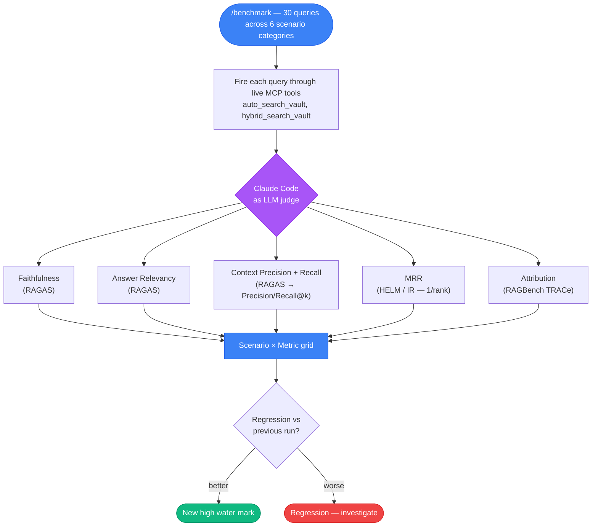
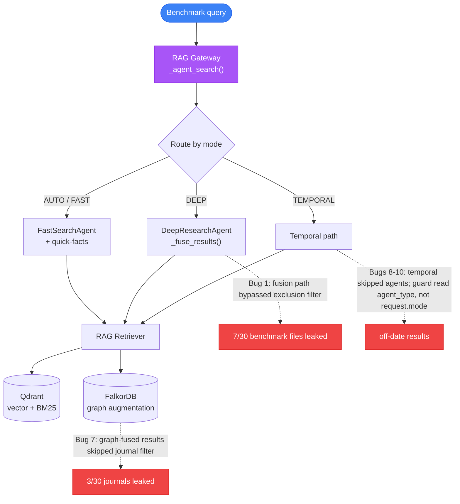
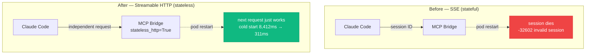

## The long weekend


Episodes 4 and 5 both teased this content as the next post; both teasers were a week early. Episode 4 promised streaming connectors (we got the code-knowledge graph in S3E5 instead). Episode 5 promised this weekend (we got the Mar 18-19 audit cascade in S3E6 instead). Here, finally, is the weekend itself.

Run 28 of the benchmark suite had been sitting at 0.67 overall for a week. MRR at 0.72. The factual-004 query — "What GPU does the platform use and how is VRAM allocated?" — had failed fourteen consecutive runs. Every time, the vector search returned 750-token chunks that mentioned GPUs in passing but never stated the answer directly.

The plan for Saturday was supposed to be small. Two tickets. Quiet weekend.

## How you measure "better"

Before any of the numbers in this post mean anything, one question has to have an answer: *how do you know search got better and not just different?* For most of this platform's life there was no answer. Search "worked" — but there was no data on whether a result was faithful, whether the right document came back first, or whether last week's change quietly made things worse.

So the weekend before all this, I built a benchmark suite (VW-143), and I borrowed its design straight from the academic RAG-evaluation literature rather than inventing metrics:

- **[HELM](https://crfm.stanford.edu/helm/)** (Stanford's Holistic Evaluation of Language Models) contributes the core shape: evaluate across a *grid* of many scenarios × many metrics, never a single score. The suite runs **30 queries across 6 scenario categories** — factual lookup, temporal, analytical, cross-domain, code-intelligence, and freshness.
- **[RAGAS](https://docs.ragas.io/)** ([paper](https://arxiv.org/abs/2309.15217)) contributes four of the metrics: **Faithfulness** (is the answer grounded in the retrieved context, or hallucinated?), **Answer Relevancy**, **Context Precision** (did the relevant docs rank high — Precision@k), and **Context Recall** (did we retrieve all the relevant docs — claim-level, not keyword overlap).
- **[RAGBench](https://arxiv.org/abs/2407.11005)**'s TRACe framework contributes **Attribution** — the metric that makes a bad score *actionable*, telling you whether to fix retrieval or fix synthesis.
- **MRR** (Mean Reciprocal Rank) is the classic information-retrieval metric: `1 / rank` of the first relevant result. Top result → 1.0; second → 0.5; fifth → 0.2; nothing relevant → 0.0. It matters most for factual queries, where the reader only looks at the first answer.

The trick that makes this affordable on a self-hosted platform: **Claude Code is the LLM judge.** No GPT-4 API bill, no extra eval infrastructure — the same agent that runs the queries scores them against structured rubrics, then writes a versioned report and diffs it against the previous run. (Borrowing the idea, honestly, from [CRAG](https://arxiv.org/abs/2406.04744), Meta's comprehensive RAG benchmark.) The one caveat I keep stapled to every number: these scores are *relative to Claude's judgment*. A 0.86 faithfulness means "0.86 by this judge," not a universal truth comparable to a GPT-4-scored RAGAS run.



That grid is the instrument every number below is read off of.

## The week before

The benchmark suite (VW-143, delivered the previous week on March 17) had been revealing gaps all week. By Wednesday March 25, five tickets were queued:

- VW-164: code intelligence benchmark gaps — [FalkorDB](https://www.falkordb.com/) entity matching wasn't surfacing PDG nodes for code-structure queries
- VW-165: temporal-001 regression returning zero results for valid date queries
- VW-167: graph augmentation injecting off-date documents into temporal results
- VW-168: what was first logged as 53 test-isolation failures — actually 135, plus 8 collection errors masking the rest — from module-level imports poisoning `sys.modules` across the pytest session
- VW-169: the freshness decay curve needed a data-driven replacement — the linear 14-day cutoff was too aggressive for a project where active Jira tickets remain relevant regardless of document age

Thursday added VW-171 — migrating BM25 from a CPU-side index to [Qdrant](https://qdrant.tech/) native sparse vectors with server-side [Reciprocal Rank Fusion](https://plg.uwaterloo.ca/~gvcormac/cormacksigir09-rrf.pdf). And VW-172, an embedding cache to eliminate the 2-3 second per-query embedding overhead.

Seven tickets queued for a weekend that was supposed to be quiet.

## Saturday — the sprint begins

Saturday March 28 opened with Run 28 as the baseline: 0.67 overall, MRR 0.72. The first deploy went out, and Run 29 immediately found two bugs.

**Bug 1** was a filter gap in the deep research agent. `DeepResearchAgent` has its own result-fusion path — `_fuse_results` — that merges BM25 and graph enrichment results, bypassing the benchmark-exclusion filter that `BaseAgent` applies to vector results. Seven of thirty benchmark queries returned the benchmark report files themselves as top results. The fix was a single line, called after graph enrichment and before the final trim:

```python
# DeepResearchAgent — the one line that was missing
results = self._filter_benchmark_results(results)
```

**Bug 2** was a layer error. The graph search fallback — the logic that says "if graph returns zero results, try document search instead" — was placed in the MCP bridge's `graph_search_vault` tool function. But benchmark queries route through `auto_search_vault` → gateway → router → graph. The bridge function is never called in that path. The fallback had been written at the wrong level of the stack. Moved it to `_agent_search()` in the gateway, where both AUTO and GRAPH modes converge:

```python
# gateway _agent_search() — fallback now lives where the queries actually flow
if agent_result.agent_type == "graph_search" and agent_result.result_count == 0:
    agent_result = agent_router.search_fast(
        query=search_query, n_results=request.n_results, verbose=request.verbose,
    )
    routing_reason = "Graph fallback -> fast_search (AUTO->graph returned 0 results)"
```

Run 30 after both fixes: 0.66, contamination eliminated.

Then VW-174 shipped — and the score moved.

### Quick-facts: the atomic-facts insight


The quick-facts index is sixty atomic facts across seven categories — GPU allocation, port assignments, embedding model specs, MCP tool counts, infrastructure topology, search architecture, networking. Each fact is a single sentence, roughly thirty tokens. They live in a dedicated [Qdrant](https://qdrant.tech/) collection (`rootweaver_quick_facts`, 2560-dimensional cosine) and the `FastSearchAgent` queries them first for simple queries (twelve words or fewer, no deep-research trigger phrases).

The insight is quantitative. The main vault index holds tens of thousands of chunks — around 45,000 of them at roughly 750 tokens each. When the query is "What GPU does the platform use?", the embedding for that question is closest to a 30-token fact that says, almost verbatim, "The Desktop server has an NVIDIA RTX 4080 with approximately 15GB VRAM. vLLM uses it exclusively for LLM inference" — not to a 750-token chunk from an implementation report that mentions GPUs in its third paragraph alongside twelve other infrastructure details.

**Factual MRR went from 0.64 to 1.00.** The factual-004 query that had failed fourteen consecutive runs was now rank 1. Run 31: 0.68 overall, factual MRR 0.90.

Two more bugs surfaced with quick-facts live. **Bug 3**: the query "How many MCP tools are exposed to Claude Code?" scored complexity 4 and routed to deep research. Quick-facts only fire in fast search. The word "how" was in the `deep_questions` list, triggering a +2 complexity penalty. But "how many" is a counting question, not analytical. The fix exempts the counting phrases:

```python
deep_questions    = ["how", "why", "explain", "compare", "analyze"]
factual_overrides = ["how many", "how much"]
# "how" still adds +2 complexity — unless it's a counting question
if any(q_word in q for q_word in deep_questions) and not any(fo in q for fo in factual_overrides):
    score += 2
```

**Bug 4**: the Qdrant client on K3s had been upgraded, and v2 renamed `.search()` to `.query_points()`. The quick-facts search broke silently on deploy:

```python
# before — qdrant-client v1
qf_hits = self._quick_facts_client.search(
    collection_name=self._quick_facts_collection,
    query_vector=query_embedding, limit=3, score_threshold=0.5,
)
# after — qdrant-client v2
qf_response = self._quick_facts_client.query_points(
    collection_name=self._quick_facts_collection,
    query=query_embedding, limit=3, score_threshold=0.5,
)
qf_hits = qf_response.points
```

*Atomic facts beat large chunks. Not because the embedding model is bad at large documents — it isn't — but because a 30-token statement about one thing is a better embedding target than a 750-token document about twelve things.*

## Saturday evening into Sunday — the long tail of bugs


The rest of Saturday and into Sunday morning was a sequence of bugs that each looked small and each turned out to involve a different assumption about how the search pipeline routes queries.

**Bug 5**: the freshness strategy system — four strategies behind an env var and an [Unleash](https://www.getunleash.io/) feature flag — wasn't firing. `_get_freshness_strategy()` checked Unleash first, which returned `"control"` as the default (the flag didn't exist). That passed the `!= "default"` check, so the env var fallback was never reached. The fix reverses the priority — env var first, Unleash only as an override:

```python
def _get_freshness_strategy(self) -> str:
    # env var first, so `kubectl set env` actually wins
    env_strategy = os.getenv("FRESHNESS_STRATEGY", "")
    if env_strategy and env_strategy != "control":
        return env_strategy
    # only then fall back to the Unleash variant
    ...
```

**Bug 6**: once the freshness strategy fired, the `date_scroll` strategy only worked for one of five queries. The client was built with `QdrantClient(host=...)` but the config returned a URL with an `http://` prefix. Qdrant's client rejects a protocol string in the `host` parameter. The fix checks for a URL first:

```python
url = os.getenv("QDRANT_URL", "")
if url and "://" in url:
    client = QdrantClient(url=url)            # protocol present → use url=
else:
    client = QdrantClient(host=host, port=port)  # bare host → host= + port=
```

**Bug 7**: three of thirty queries returned streaming journal files via FalkorDB entity matching. Graph augmentation at the gateway level fetches documents by entity match and injects them after the agent's exclusion filter has already run. The journal exclusion filter applied to vector and BM25 results but not to graph-fused results. Fix: applied the `_BENCH_PATTERNS` filter to the fused set, immediately after graph augmentation:

```python
# filter the *fused* results, not just the agent's own — this was the last leak
fused = [
    r for r in fused
    if not any(
        pat in f"{r.get('file_path', r.get('file', ''))} {r.get('metadata', {}).get('source', '')}"
        for pat in _BENCH_PATTERNS
    )
]
agent_result.results = fused
```

**Bug 8**: `SearchMode.TEMPORAL` was not in the agent routing list at line 302 — the list was `[AUTO, FAST, DEEP, GRAPH]`. Temporal queries bypassed agents entirely and went to a basic retriever path with raw Qdrant timestamp filtering, missing all agent features. Fix: added a TEMPORAL branch that routes through the agent for ranking, then post-filters by date (condensed from the real block):

```python
elif request.mode == SearchMode.TEMPORAL:
    # route through the agent for ranking, then post-filter by date
    agent_result = agent_router.search_fast(
        query=search_query,
        n_results=request.n_results * 4,   # overfetch so enough survive the date filter
        verbose=request.verbose,
    )
    agent_result.results = [
        r for r in agent_result.results
        if ts_gte <= float(r.get("metadata", {}).get("timestamp", 0)) <= ts_lte
    ][:request.n_results]
```

But this broke date filtering because the agent doesn't pass date parameters down to Qdrant — it just ranks, and the post-filter is left holding the bag.

**Bug 9**: the temporal post-filter attempt failed because the overfetched twenty results from FastSearchAgent didn't contain any documents from the target date range. Graph augmentation then injected entity-matched documents from random dates. The post-filter was filtering an already-wrong result set. Fix: bypass the agent entirely and scroll Qdrant directly with a timestamp range filter, so the date match is guaranteed at query time (condensed):

```python
# post-filtering filtered the wrong set; scroll Qdrant by timestamp instead
points, _ = qclient.scroll(
    collection_name=qdrant_col,
    scroll_filter=Filter(must=[
        FieldCondition(key="timestamp", range=Range(gte=ts_gte, lte=ts_lte))
    ]),
    limit=request.n_results * 4, with_payload=True, with_vectors=False,
)
points.sort(key=lambda p: p.payload.get("timestamp", 0), reverse=True)  # newest first
```

**Bug 10**: even with the timestamp scroll producing correct results, graph augmentation replaced them. The `_is_temporal` guard checked `agent_result.agent_type == "retriever"`, but temporal queries now routed through FastSearchAgent, so the agent type was `"fast_search"`. The guard failed, graph augmentation ran. The fix keys off the request, which never lies about intent:

```python
# before — breaks the moment temporal routing changes the agent
_is_temporal = agent_result.agent_type == "retriever"
# after — the request mode is always correct
_is_temporal = request.mode == SearchMode.TEMPORAL
```

Run 34 tied the previous high water mark at 0.73. Run 36 — after the temporal guard fix — hit **0.74, MRR 0.80. New all-time high.**

If you look at Bugs 1, 7, 8, 9 and 10 together, they're the same shape: every distinct code path through the pipeline had its *own* idea of which results to exclude, and the paths I forgot were the ones that leaked.



### The scoring pipeline audit

Between the bugs, five parallel audit passes found systemic issues in the scoring pipeline:

The `min_score` threshold was 0.2 — valid results scoring 0.15-0.19 were being silently discarded. Cross-domain queries (like "What is the NetworkPolicy for inter-namespace traffic?") returned zero results because their scores fell in that gap. Lowered to 0.15.

Graph enrichment results had a fixed score of 0.015 — below the 0.2 `min_score` threshold. Every graph result from FalkorDB was being filtered out. All the graph work from S3E5 — Leiden community detection, entity extraction, code-knowledge traversal — was invisible to search. Raised to 0.25.

Jira ID boost was +0.02. Exact file path matches from Jira ID search were losing to any semantic result scoring 0.3+. Searching for "VW-174" returned five documents that mentioned ticket numbers in passing before the actual VW-174 implementation report. Raised to 0.30.

And 28% of the Qdrant index — 16,469 points — was auto-generated streaming journal milestones. Repetitive, near-identical entries produced hourly by a Haiku summarisation pipeline. They were drowning out real content. Added `01-Journal/Streaming/` to the exclusion filter. Another 1,110 Syncthing conflict files (pure duplicates) and two credentials documents also excluded — 17,579 points removed in total.

## Sunday evening — Thread B: the MCP transport migration


While the search quality sprint was running, a parallel thread was rebuilding the MCP bridge's transport layer.

The MCP bridge — the service that exposes the platform's thirty tools to Claude Code over the network — had been running on Server-Sent Events (SSE) since S3E3. SSE works, but it has a structural problem in Kubernetes: each SSE connection is a persistent stream with a session ID, and when a pod restarts, the session dies. Claude Code's MCP client holds the stale session ID and every subsequent tool call returns `-32602: invalid session`. The only fix is to start a new conversation.

VW-177 migrated the bridge from SSE to [Streamable HTTP](https://modelcontextprotocol.io/specification/2025-03-26/basic/transports#streamable-http) — a newer MCP transport where each request is independent. The key configuration: `stateless_http=True` in [FastMCP](https://github.com/jlowin/fastmcp) 3.1.1. No session tracking, no session ID, no pod-restart breakage. Every request stands alone. The `-32602` error was eliminated structurally, not patched.



The same deploy scaled the retriever to two replicas (each loading [Qwen3-Embedding-4B](https://huggingface.co/Qwen/Qwen3-Embedding-4B) independently, ~995MB RAM each), enabled Qdrant scalar INT8 quantization (4× vector memory reduction with `always_ram: true`), and switched the search pipeline's LLM calls from [Ollama](https://ollama.com/)'s 0.8B CPU model to [vLLM](https://docs.vllm.ai/)'s 8B GPU model (DeepSeek-R1-0528-Qwen3-8B-AWQ) with Ollama as fallback.

The benchmark numbers:

| Metric | SSE Baseline | After (HTTP + scaled + quant + vLLM) | Change |
|---|---|---|---|
| Cold start | 8,412ms | 311ms | **-96%** |
| Connection P50 | 17.5ms | 9.8ms | **-44%** |
| Light tool P50 | 31.8ms | 22.0ms | **-31%** |
| Concurrent C=6 P50 | 12,366ms | 4,632ms | **-63%** |

What each row is actually measuring (all latencies are **P50** — the median, so half the requests were faster and half slower; I report the median rather than the mean so a couple of slow outliers can't flatter or wreck the number):

- **Cold start** — the very first request after a fresh connection. This is the worst case a user feels when (re)connecting, and under SSE it carried the entire stream-setup handshake.
- **Connection P50** — time just to *establish* the transport, before any real work happens.
- **Light tool P50** — round-trip for a trivial tool call (a ~70-byte response). It isolates raw protocol overhead from the cost of actual search.
- **Concurrent C=6 P50** — latency when six tool calls hit the bridge at once. This is the contention test — how the bridge behaves when it's busy, not idle.

The cold start improvement is the headline. SSE stream setup required an 8.4-second handshake on the first request. Streamable HTTP treats every request independently — first request is 311ms. The C=6 number is the one I care about in daily use: it came from vLLM handling classification calls in milliseconds on GPU instead of Ollama taking seconds on CPU, so the bridge stops buckling when several tools fire together.

One hour was lost to a discovery about Claude Code's MCP client configuration. The bridge was live, the transport was working, but Claude Code couldn't see the tools. The reason: Claude Code does not read `~/.config/claude-code/mcp_servers.json`. It reads a `.mcp.json` file at the project root. The documentation at the time was ambiguous; the fix was a file rename.

## Sunday evening — the CVE that arrived on time


The same Sunday evening, a different automation delivered a different kind of result.

VW-175, filed at 21:56 BST, set up [Perplexity](https://www.perplexity.ai/) Pro Deep Research Spaces — automated scheduled searches across three domains (AI infrastructure, platform security, industry trends). The first scheduled run for the platform-security space completed within hours.

VW-176, filed at 22:07 BST, was the result: **CVE-2026-4404, CVSS 9.4 — hard-coded credentials in [Harbor](https://goharbor.io/) 2.15.0 and below.** Harbor is the platform's container registry, running on K3s at NodePort 30500. A compromised Harbor means the ability to push malicious container images that [FluxCD](https://fluxcd.io/) would auto-deploy to the cluster.

Patched by 22:11 BST. Four minutes from filing to resolution — the same ratification pattern as VW-147 in Episode 6, where the work runs ahead of the ticket.

The timing is what makes it worth noting. The Perplexity automation was deployed the same day as the search quality sprint. Its first real finding was a critical CVE in a service that had been running unpatched for weeks. *Automation doesn't need to be sophisticated to be valuable. It needs to run.*

## The numbers

| Metric | Start (Sat 28 Mar) | End (Sun 29 Mar) |
|---|---|---|
| Benchmark overall | 0.67 | **0.74** (+10%) |
| MRR | 0.72 | **0.80** (+11%) |
| Factual MRR | 0.64 | **1.00** |
| Code intel MRR | 0.80 | **1.00** |
| MCP cold start | 8,412ms | **311ms** (-96%) |
| Bugs found/fixed | 0 | **10** |
| Commits | 0 | **17** (search) + transport |
| New tests | 0 | **84+** |
| Qdrant noise removed | — | **17,579 points** (~30% of index) |
| Jira tickets closed | 0 | **8** (VW-171-178) |

Reading that table by group, because the rows aren't all the same kind of thing:

- **The quality scores** — *Benchmark overall* is the single aggregate across the whole scenario×metric grid; it's the "search got better holistically, not just on one query type" number. *MRR* is the 1/rank measure averaged over all 30 queries, and *Factual MRR* / *Code intel MRR* are that same measure restricted to those two categories. Both hitting **1.00** means the right answer comes back at rank 1 *every time* in that category — quick-facts is what pinned factual to 1.00, and the scoring fix that stopped FalkorDB graph results being filtered out is what did it for code intelligence.
- **The user-facing number** — *MCP cold start* is the transport result from the previous section, carried into the summary because it's the latency a user feels first.
- **The cost and cleanup** — *bugs, commits, tests, noise removed, tickets closed* aren't quality scores; they're what the gain took. The honest framing is right there: moving the overall score seven-hundredths of a point — 0.67 to 0.74 — cost ten bugs, seventeen search commits, eighty-plus new tests, and stripping nearly a third of the index as noise. Small numbers, real work.

## What I'd do differently


**Put the exclusion filter at the API boundary, not per-agent.** Bugs 1, 7, 8, and 10 were all variants of the same structural problem: different code paths through the search pipeline had different filter coverage. Deep research had its own fusion path that bypassed the base filter. Graph augmentation injected unfiltered results. Temporal routing skipped agents entirely. The right architecture is a single filter at the gateway's response boundary — every result, regardless of provenance, passes through one exclusion check on exit. The multi-point filter approach is a maintenance trap; every new code path through the pipeline needs its own copy of the filter, and the ones you forget are the ones that leak. (That pipeline diagram above is really a map of every place I had to remember — and the three I didn't.)

**A/B testing requires full-stack thinking.** Bug 5 (Unleash overriding env vars) and Bug 6 (host vs URL parameter) were both caused by assuming one layer of the stack without checking the layer above. The freshness strategy env var was correct; Unleash was returning a different default. The Qdrant host config was correct; the URL format included a protocol prefix the client rejected. In both cases, the bug was at the interface between two correct components. *Full-stack awareness means checking the handshake, not just the endpoints.*

## Same as every episode

Same as every episode — every piece of this is tracked through git commits, vault evidence, and Jira. The benchmark suite is VW-143; the benchmark data lives at `experiments/mcp_transport_benchmark_*.json`. The quick-facts index is at `neural-vault/quick_facts.json` (60 facts). The Jira tickets are VW-164 through VW-178, with the weekend core being VW-171-178 across Saturday 28 and Sunday 29 March 2026.

One honest note on the paper trail: no Architecture Decision Record came out of the weekend itself. These were tactical fixes, not big-design calls — the kind of work that doesn't earn an ADR while you're doing it. But two of them outlived the weekend as architectural givens. The Streamable HTTP transport (VW-177) became the assumed foundation for the later Q2-2026 retrieval-and-inference enhancement program, and switching the search pipeline to vLLM (VW-178) freed up the Ollama CPU deployment — which is exactly what a later trust-boundary decision (ADR-047) reuses, running an independent verifier LLM on the now-idle Ollama. The decisions were small that weekend; the blast radius wasn't. That's usually how it goes: the ADR gets written when a tactical choice turns out to be load-bearing.

Next episode picks up the following day — Monday March 30. The deep search bottleneck that Sunday's transport migration exposed (hybrid search still at 9.3 seconds) led to a full async refactor of the retrieval pipeline. Plus a real security incident found by the Scout fleet's second run, and a meta-discovery about an upstream bug that had quietly been deleting evidence of the work this series is trying to write about.

For the production code, blog.rduffy.uk. For the work-in-progress version with the texture, labs.rduffy.uk.

## References & links

**Evaluation research** (what the benchmark suite was built from)

- [HELM](https://crfm.stanford.edu/helm/) — Stanford's Holistic Evaluation of Language Models; the scenario × metric grid framing.
- [RAGAS](https://docs.ragas.io/) ([paper](https://arxiv.org/abs/2309.15217)) — the RAG-evaluation metrics: Faithfulness, Answer Relevancy, Context Precision, Context Recall.
- [RAGBench](https://arxiv.org/abs/2407.11005) — explainable RAG benchmark; source of the TRACe Attribution metric.
- [CRAG](https://arxiv.org/abs/2406.04744) — Meta's Comprehensive RAG Benchmark; the model-as-judge precedent.
- [Reciprocal Rank Fusion](https://plg.uwaterloo.ca/~gvcormac/cormacksigir09-rrf.pdf) — Cormack et al., SIGIR 2009; the rank-merge behind server-side hybrid search.

**Protocol & runtime**

- [MCP Streamable HTTP transport](https://modelcontextprotocol.io/specification/2025-03-26/basic/transports#streamable-http) — the spec the bridge migrated to.
- [FastMCP](https://github.com/jlowin/fastmcp) — the Python MCP framework; `stateless_http=True` lives here.

**Models & infrastructure**

- [Qwen3-Embedding-4B](https://huggingface.co/Qwen/Qwen3-Embedding-4B) — the 2560-dimensional embedding model the retriever loads.
- [Qdrant](https://qdrant.tech/) — vector database; native sparse vectors + INT8 quantization.
- [FalkorDB](https://www.falkordb.com/) — graph database backing the code-knowledge graph.
- [vLLM](https://docs.vllm.ai/) — GPU LLM serving (the 8B classifier).
- [Ollama](https://ollama.com/) — CPU LLM serving, kept as fallback.
- [Unleash](https://www.getunleash.io/) — feature-flag service behind the freshness strategies.
- [Harbor](https://goharbor.io/) — container registry; subject of the CVE.
- [FluxCD](https://fluxcd.io/) — GitOps reconciler that would auto-deploy a poisoned image.
- [Perplexity](https://www.perplexity.ai/) — Deep Research Spaces, the automation that surfaced the CVE.
